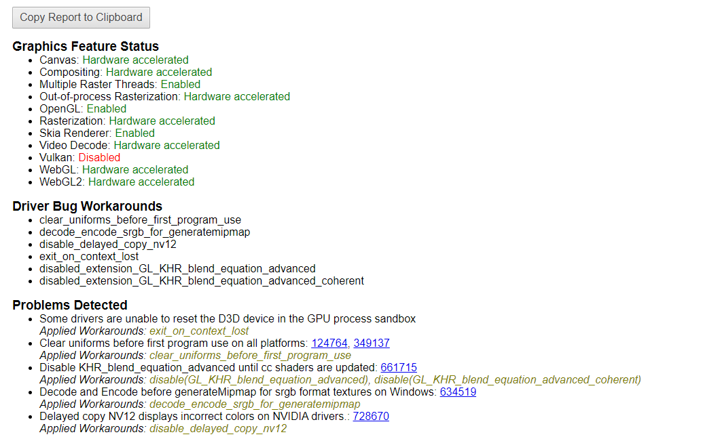
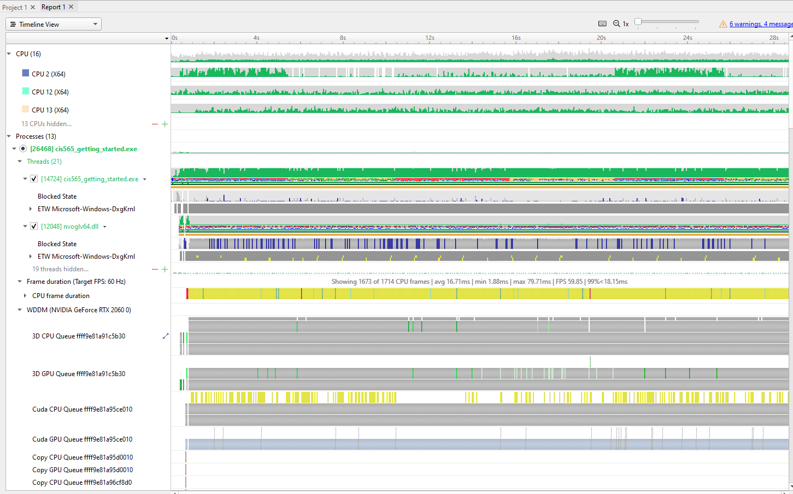
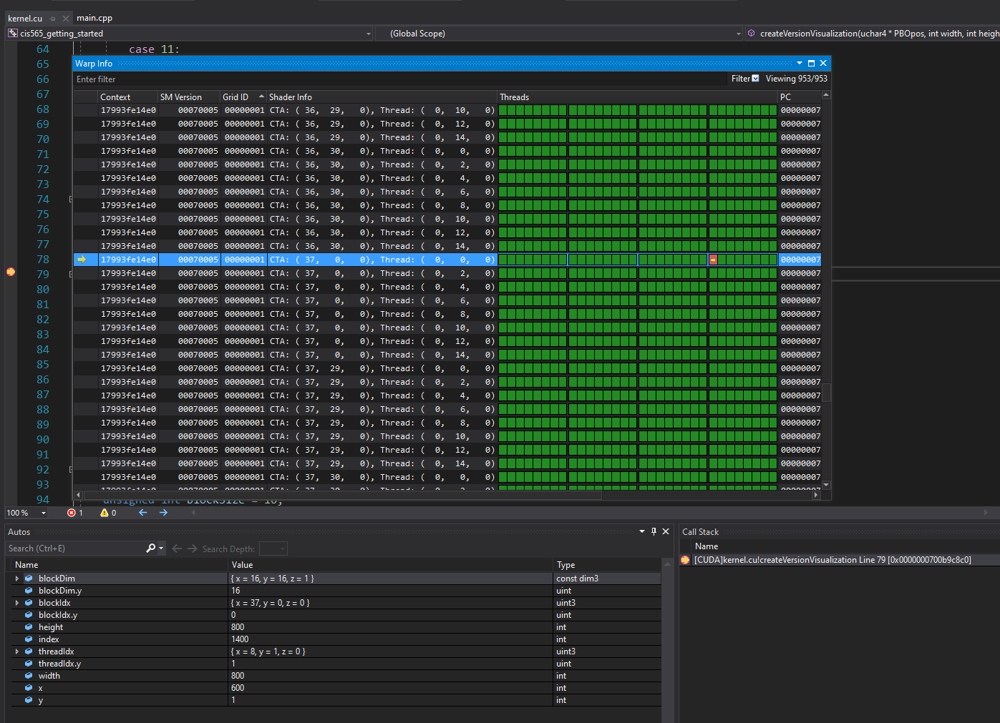
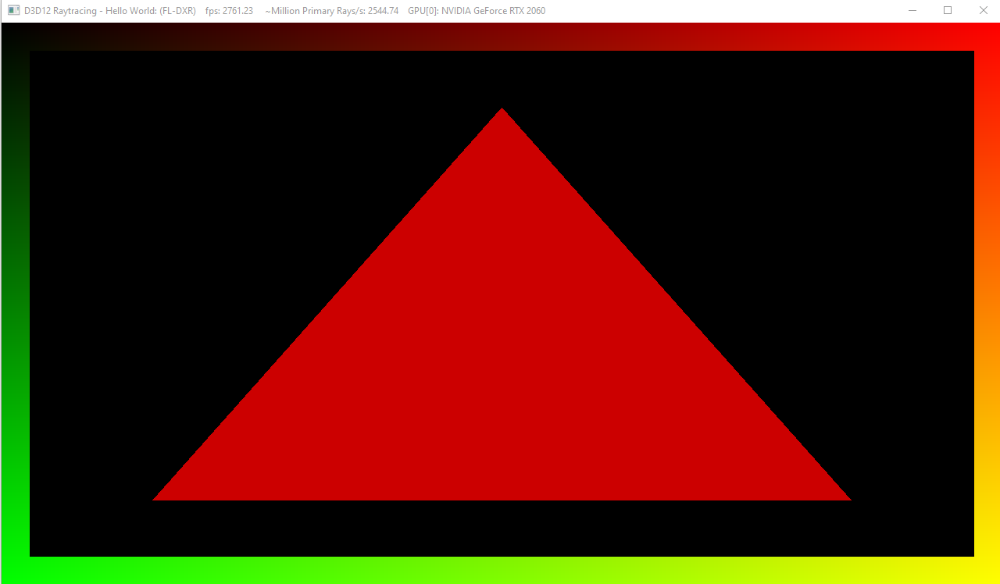

Project 0 Getting Started
====================

**University of Pennsylvania, CIS 565: GPU Programming and Architecture, Project 0**

* Beini Gu
  * [LinkedIn](https://www.linkedin.com/in/rgu/), [personal website](https://www.seas.upenn.edu/~gubeini/), [twitter](https://twitter.com/scoutydren), etc.
* Tested on: Windows 10, AMD Ryzen 7 3700X 8-Core Processor 3.59 GHz 16GB, GTX 2060

### CUDA test

### WebGL test

### NSight Profile

### Debugger test

### DRX test

