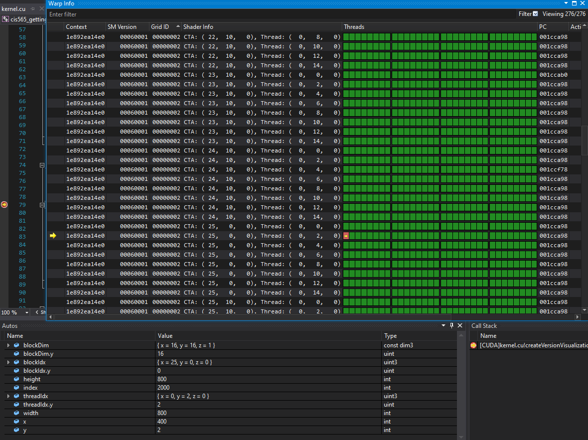
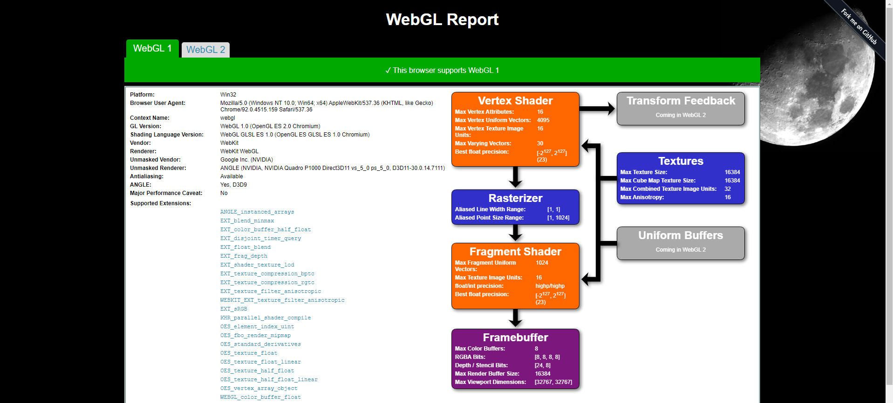

Project 0 Getting Started
====================

**University of Pennsylvania, CIS 565: GPU Programming and Architecture, Project 0**

* Emma Holthouser
  * linkedin.com/in/emma-holthouser/
* Tested on: (TODO) Windows 10, i7-6700 CPU @ 3.40GHz 16GB, Nvidia Quadro P1000 12156 MB(Towne Lab TMB62-12)

README
-----------

Cuda Project Modification
------------------------------

Nsight Analyze
----------------------
I am using a CETS computer and I am currently not able to analyze without adminstrative access. 

Nsight Debugging
-------------------

WebGL Support
-----------------------------

RTX Support
-----------
I am currently using a CETS computer which does not have any level of RTX Support without adminstrative access allowing for developer mode to be enabled. 

