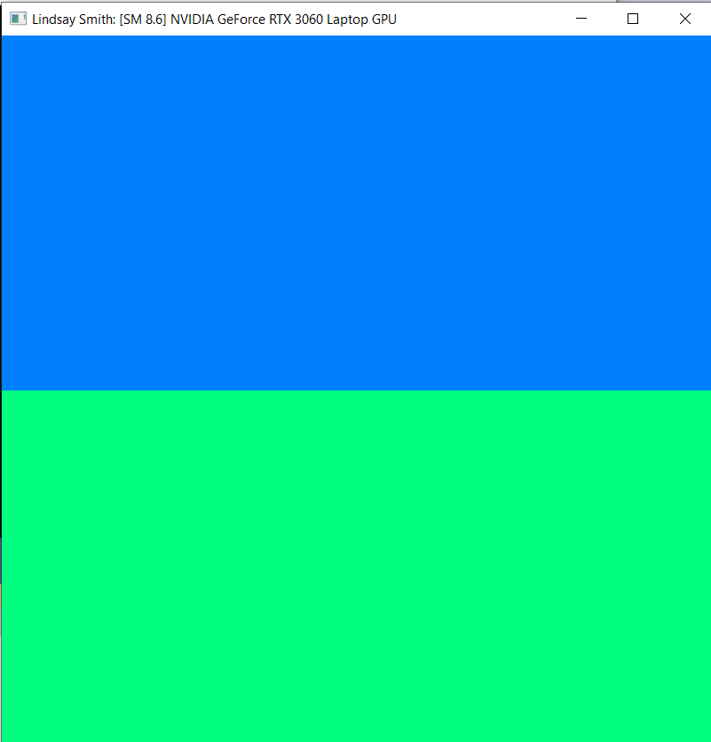
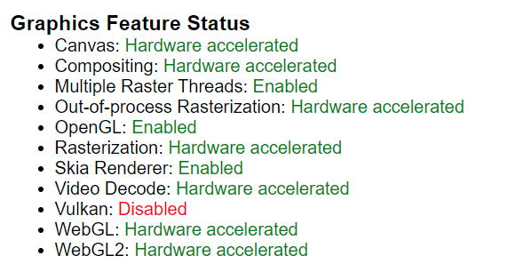

Project 0 Getting Started
====================

**University of Pennsylvania, CIS 565: GPU Programming and Architecture, Project 0**

* Lindsay Smith
  * [LinkedIn](https://www.linkedin.com/in/lindsay-j-smith/), [personal website](https://lindsays-portfolio-d6aa5d.webflow.io/)
* Tested on: Windows 10, i7-11800H 144Hz 16GB RAM, GeForce RTX 3060 512GB SSD (Personal Laptop)

First edit to have my name appear at the top bar of the window

WebGL Hardware Accelerated

