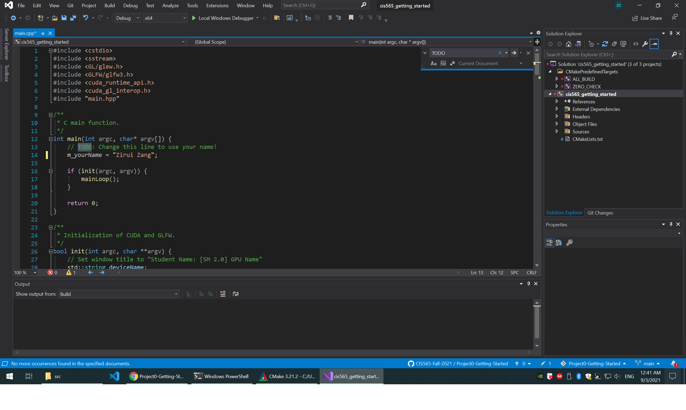
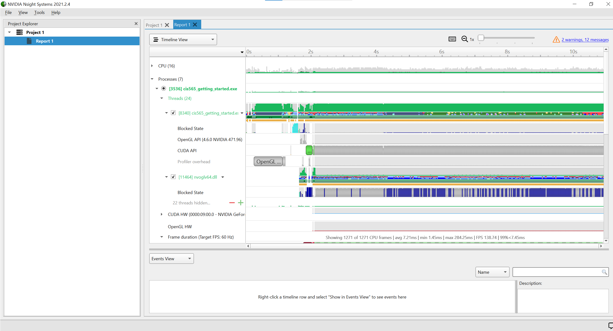
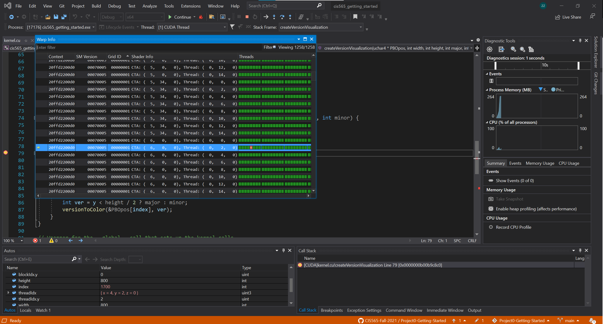
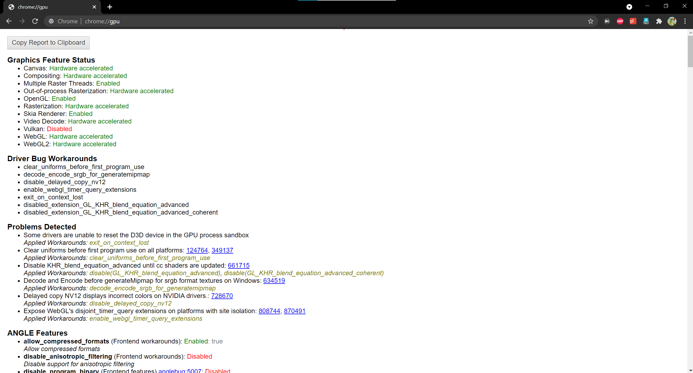
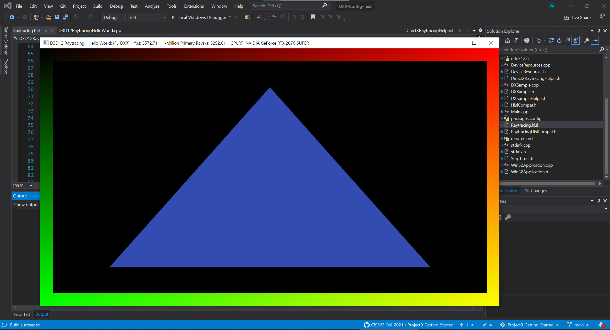

Project 0 Getting Started
====================

**University of Pennsylvania, CIS 565: GPU Programming and Architecture, Project 0**

* Zirui Zang
  * [LinkedIn](https://www.linkedin.com/in/zirui-zang/)
* Tested on: Windows 10, AMD Ryzen 7 3700X @ 3.60GHz 32GB, RTX2070 SUPER 8GB (Personal)

### Screenshots
Part 3.1.1: Modify the CUDA Project

Part 3.1.2: Analyze

Part 3.1.3: Nsight Debugging

Part 3.2: WebGL

Part 3.3: DXR
