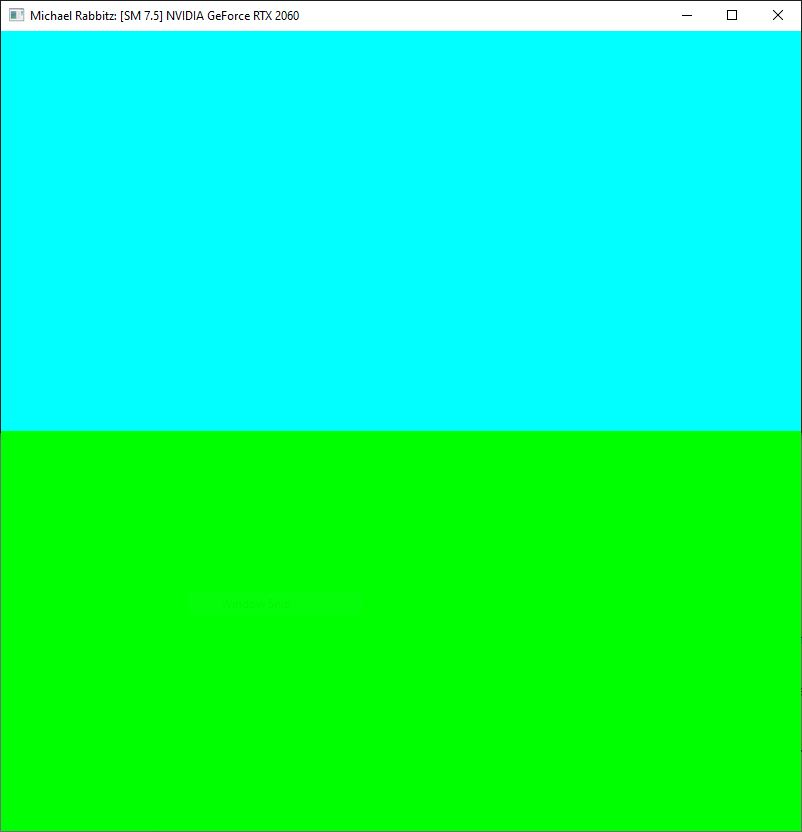
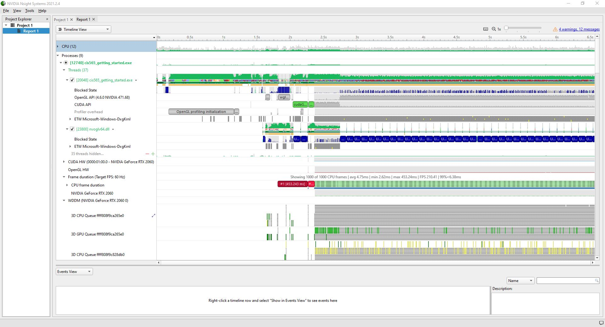
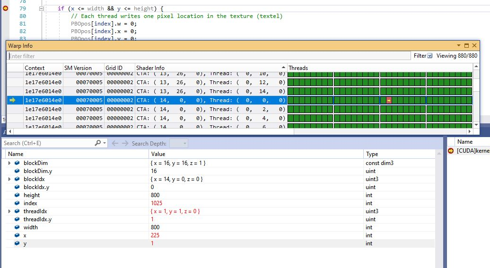
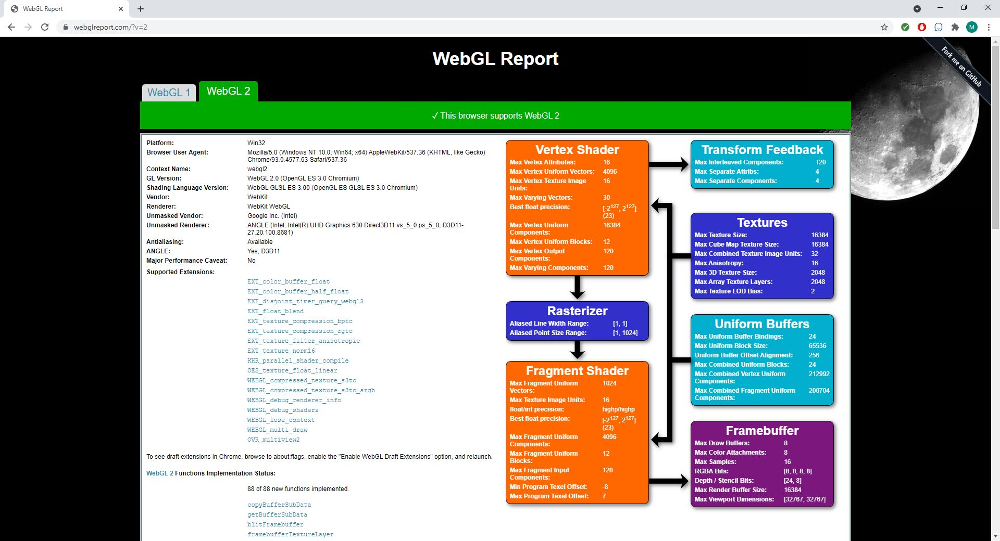
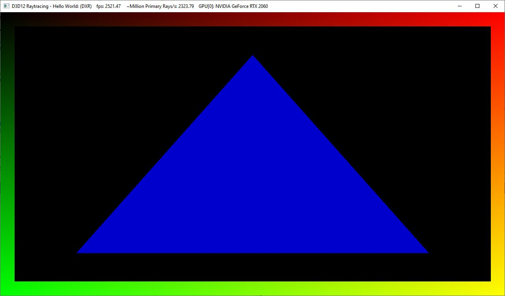

Project 0 Getting Started
====================

**University of Pennsylvania, CIS 565: GPU Programming and Architecture, Project 0**

* Michael Rabbitz
  * https://www.linkedin.com/in/mike-rabbitz/
* Tested on: Windows 10, i7-9750H @ 2.60GHz 32 GB, RTX 2060 6GB (Personal)

## Results
### Part 3.1: CUDA
#### The Cuda Compute Capability of my RTX 2060 is 7.5 as displayed in the following image:

#### Nsight Trace:

#### Nsight Debugging:
Index condition set to index == 1025.
The block index shows correspondance between variable blockIdx in the Autos window and CTA under the Shader Info column within Warp Info.
The thread index shows correspondance where if you look at Thread under Shader Info within Warp Info, in the highlighted row the value (0, 0, 0) is the first index of the 4 green segments to the right. The 2 green segments on the left hold value 0 for y (x, 0, z), and the right 2 segments hold value 1 for y (x, 1, z). Within each set of 2 segments, there are 16 sub-segments (8 sub-segments in each segment). From left to right, they hold the value 0 to 15, and this value is given to x. This shows why the threadIdx is {x = 1, y = 1, z = 0} for the sub-segment with the yellow arrow and red background.

### Part 3.2: WebGL
#### WebGL 2.0 Compatability:

### Part 3.3: DXR
#### The RTX 2060 has full hardware support for DXR:

