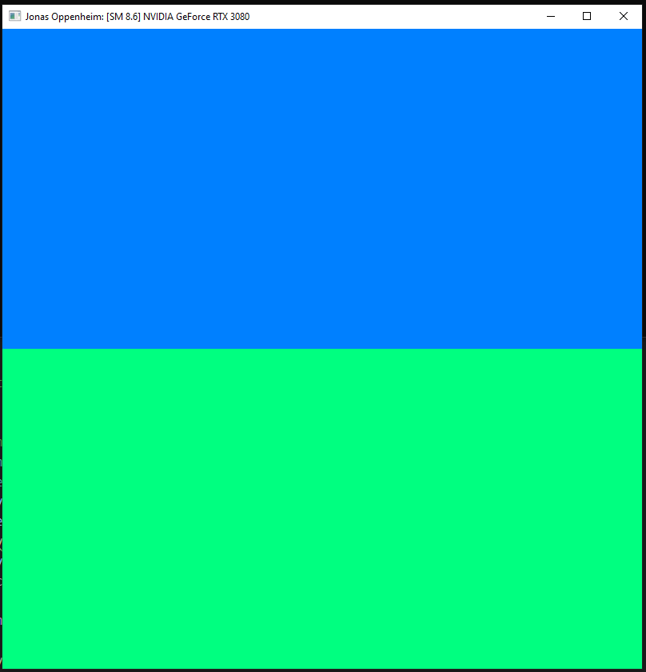
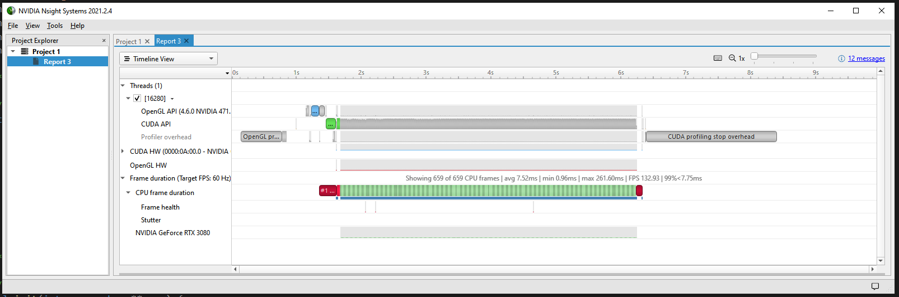
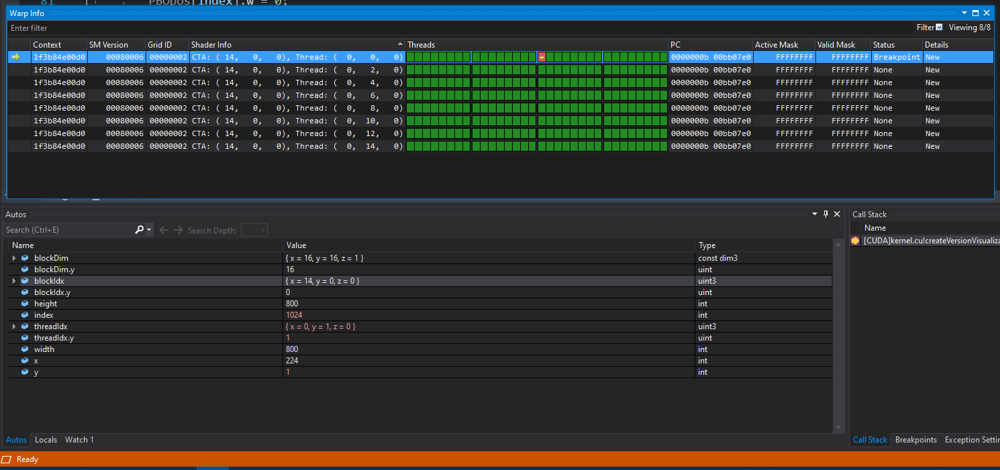
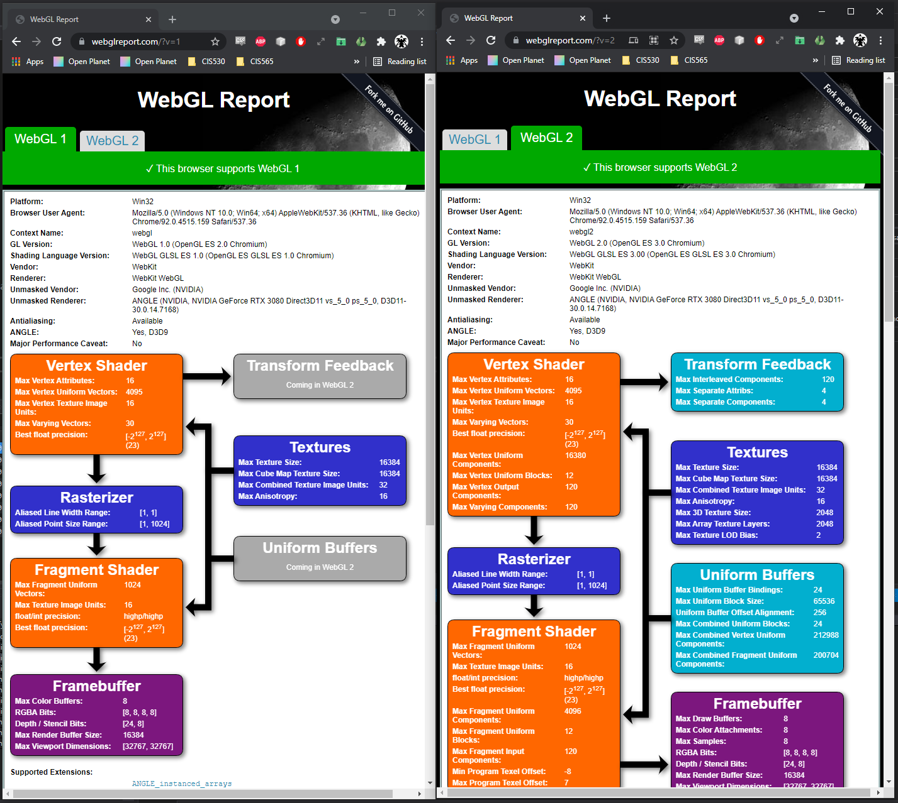
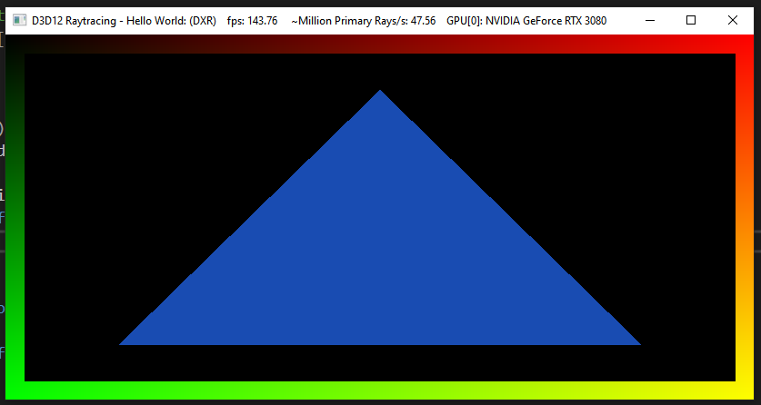

Project 0 Getting Started
====================

**University of Pennsylvania, CIS 565: GPU Programming and Architecture, Project 0**

* Jonas Oppenheim ([LinkedIn](https://www.linkedin.com/in/jonasoppenheim/), [GitHub](https://github.com/oppenheimj/), [personal](http://www.jonasoppenheim.com/))
* Tested on: Windows 10, Ryzen 9 5950x, 32GB, RTX 3080 (personal machine)

The purpose of this assignment was to get our machines set up with all the tools needed for the course. The following screenshots correspond to various requirements detailed in `INSTRUCTION.md`.

### 3.1.1: Modify the CUDA Project and Take a Screenshot

### 3.1.2: Analyze

### 3.1.3: Nsight Debugging

### 3.2: WebGL

### 3.3: DXR
