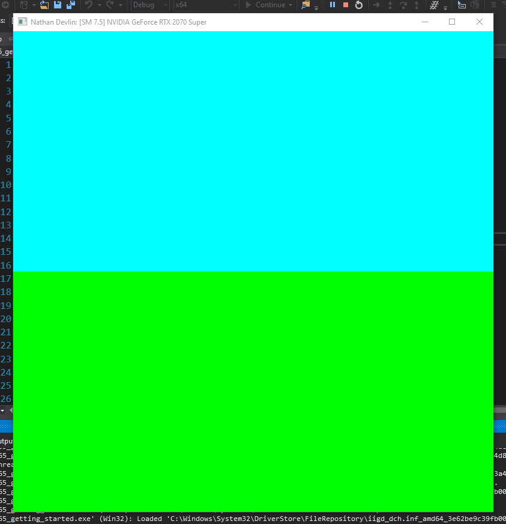
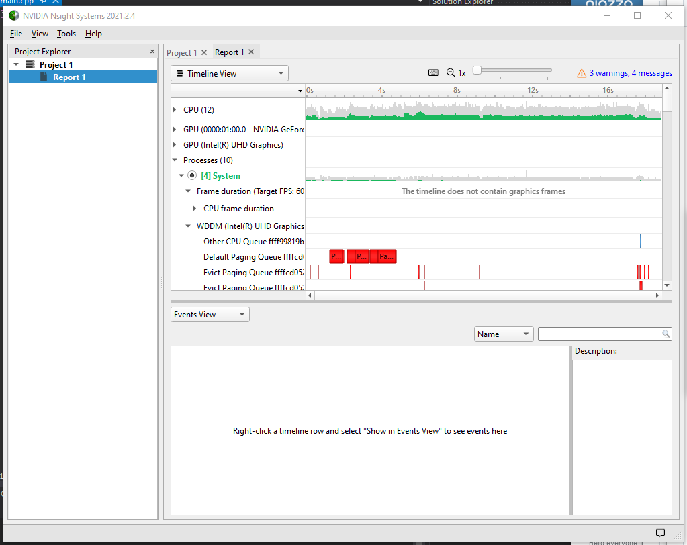
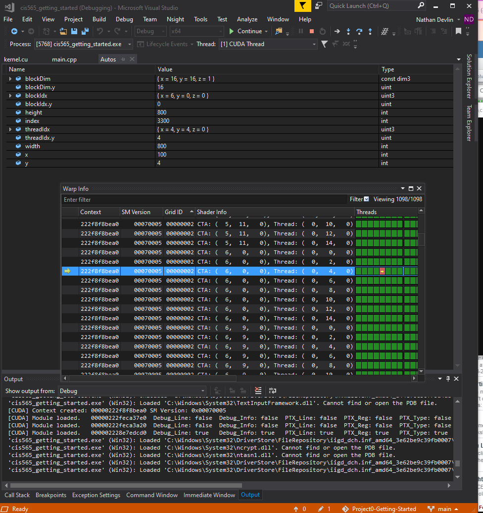
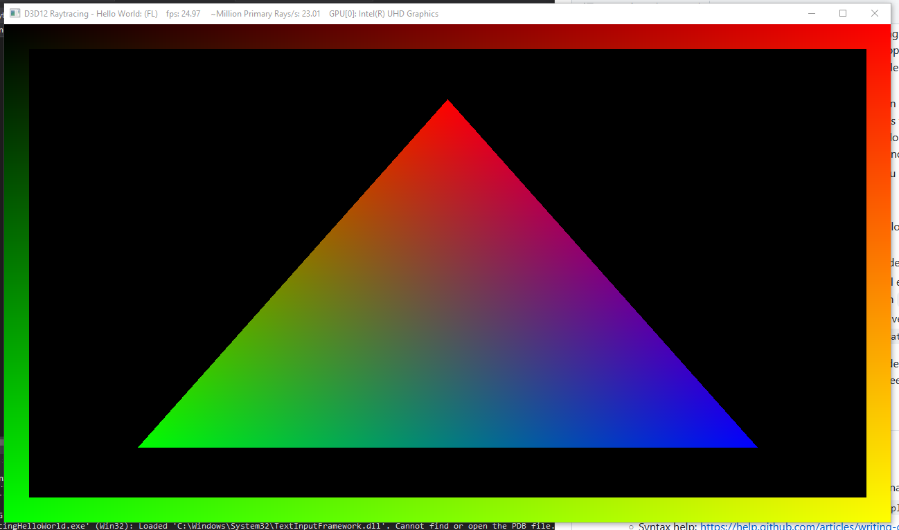
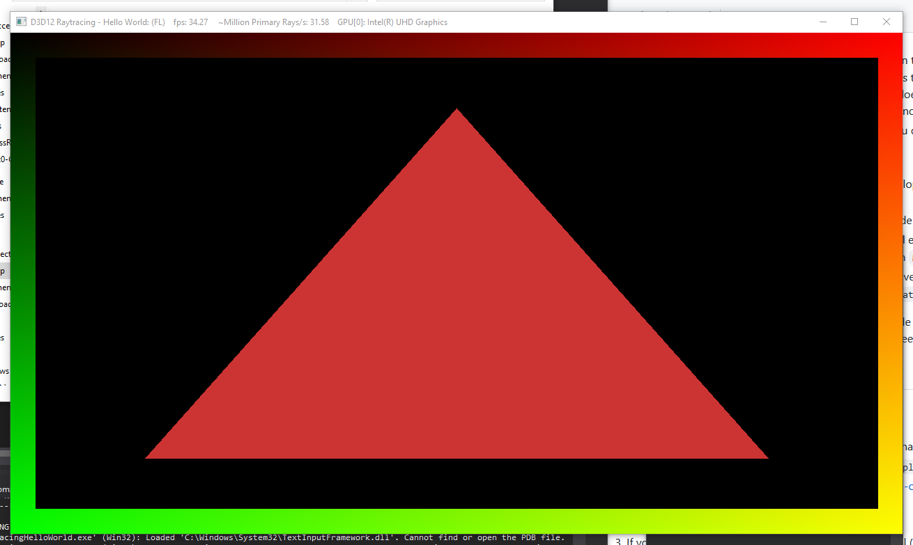

Project 0 Getting Started
====================

**University of Pennsylvania, CIS 565: GPU Programming and Architecture, Project 0**

* Nathan Devlin
  * [LinkedIn](https://www.linkedin.com/in/nathandevlin), [personal website](https://www.ndevlin.com), [twitter](NA), etc.
* Tested on: (TODO) Windows 10, Intel i7-1075H @ 2.60GHz 32GB RAM, RTX 2070 Super mobile 8 GB GDDR6 memory https://www.linkedin.com/in/nathandevlin Nvidia Driver 471.68

