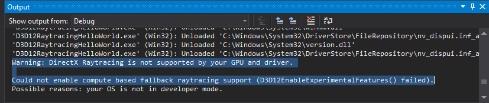

Project 0 Getting Started
====================

**University of Pennsylvania, CIS 565: GPU Programming and Architecture, Project 0**

* Matt Elser
  * [LinkedIn](https://www.linkedin.com/in/matt-elser-97b8151ba/)
* Tested on: Windows 10, i7-6700 @ 3.4GHz 16GB, Quadro P1000 4GB (Moore 100 Lab)

## Results
After the virtual lab instances failed to yield a machine with the required GPU and tools, 
a Moore lab machine was used to run the relevant code. While it was feasible to run most of 
the required steps, logistical hurdles and the noted incompatibilities suggest purchasing 
personal hardware is a better solution for future projects. 

### ✅ run main.cpp
This output indicates the major/minor compute capability of the device, converting this data 
to colors and displaying them on the screen. Green indicates 4|5, red indicates 1. The image 
is calculated using a kernel, so the display of it indicates a successful utilization of the device. 

### ❌ unsuccessful performance Analysis
There is a known issue on the CETS machines preventing performance analysis from running. 
The fix requires privileges beyond those provided in order to install additional developer 
tools.

### ✅ Nsight debugging
Here the debugger is halted based on a given conditional (`index` is a specified value)

### ✅ webGL verification
chrome confirms webGL is supported. 

### ❌ DirectX RayTracing
DXR fails. As noted in the output, this may be due to driver or hardware incompatibilities, 
neither of which is fixable on Moore lab machines 

