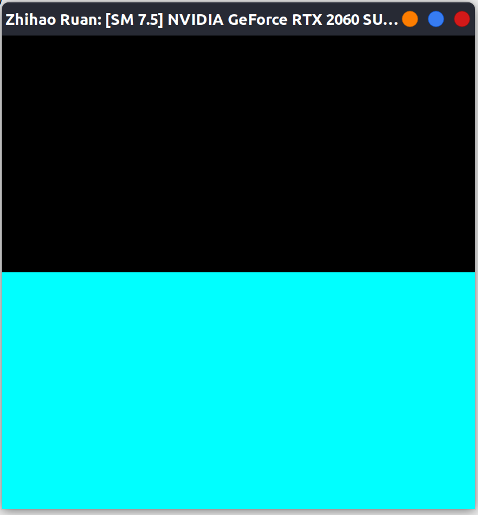
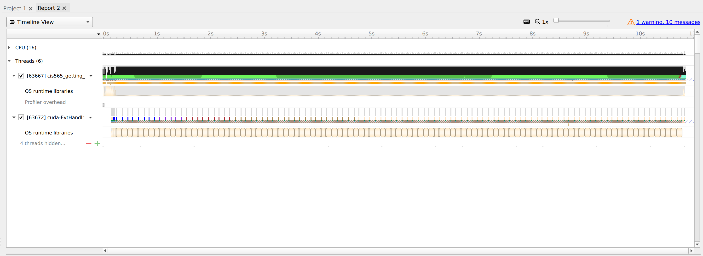
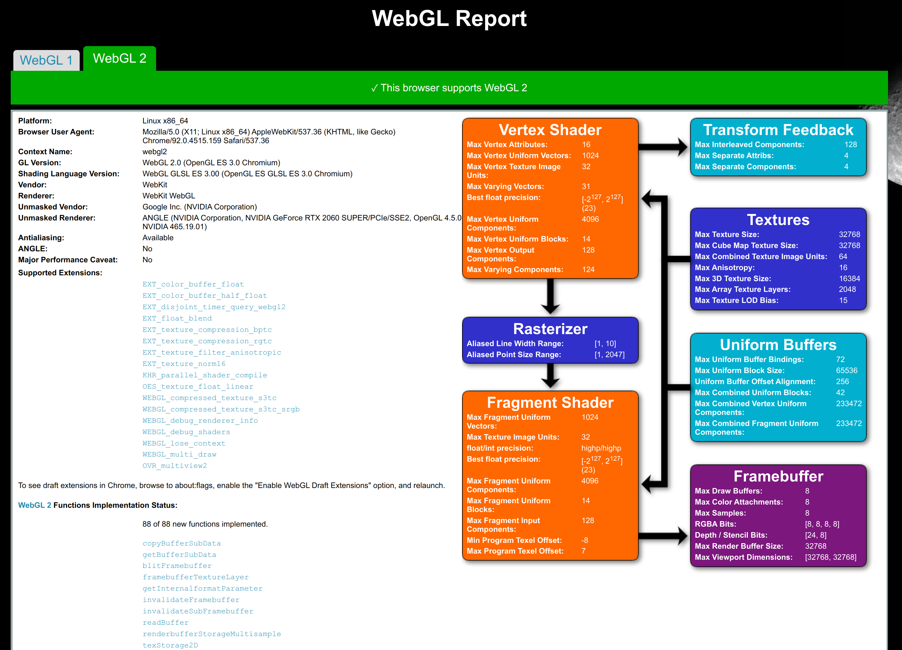
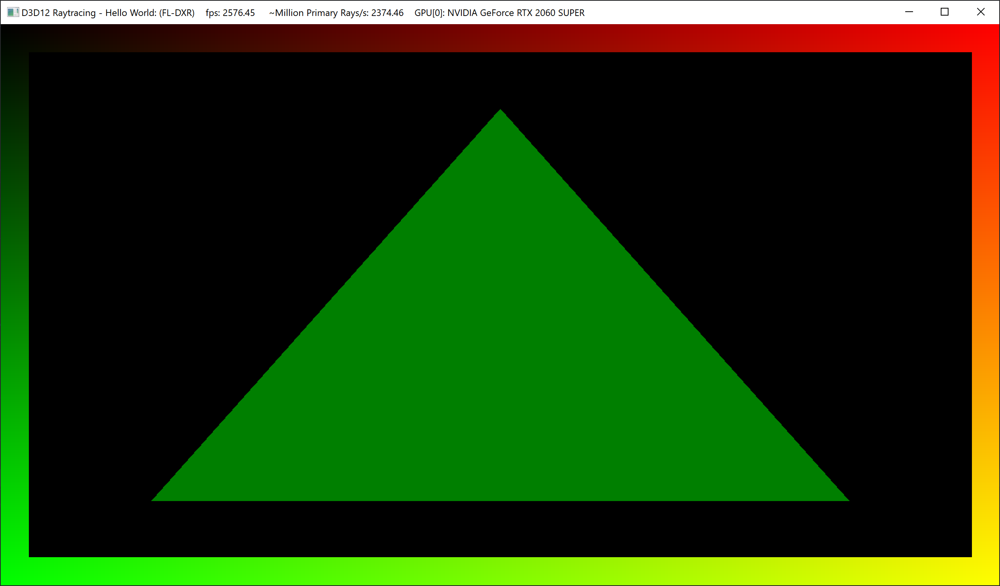

Project 0 Getting Started
====================

**University of Pennsylvania, CIS 565: GPU Programming and Architecture, Project 0**

* Zhihao Ruan
  * [LinkedIn](https://www.linkedin.com/in/zhihao-ruan-29b29a13a/), [personal website](https://zhihaoruan.xyz/), etc.
* Tested on: 
  * Windows 10, Ryzen 7 3700X, RTX 2060 Super 8GB
  * Ubuntu 20.04 LTS, Ryzen 7 3700X, RTX 2060 Super 8GB

## Submissions
This section contains the screenshots submitted for Project 0.

### Window of `cuda-getting-started` With Title

    

### Nsight Performance Analysis

### WebGL Compatibility

### DXR Rendering

## Other Contributions
1. Added `clang-format` in each of the source folders to ensure consistent code formatting.

