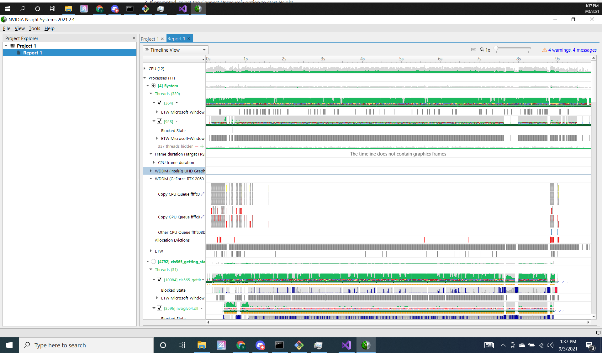
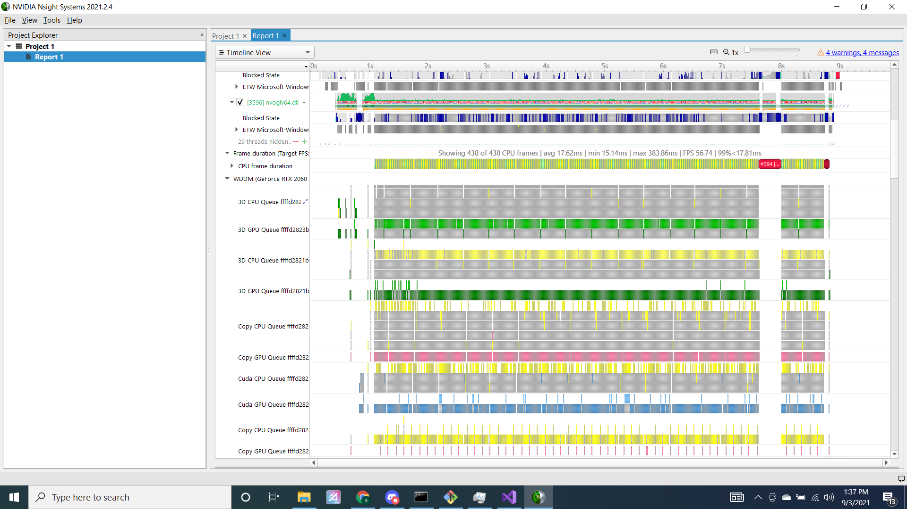
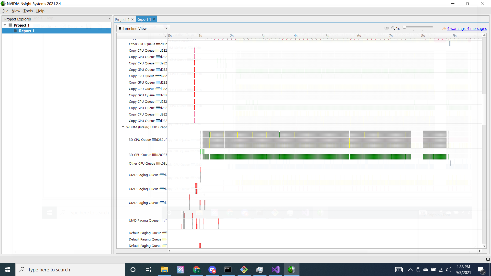
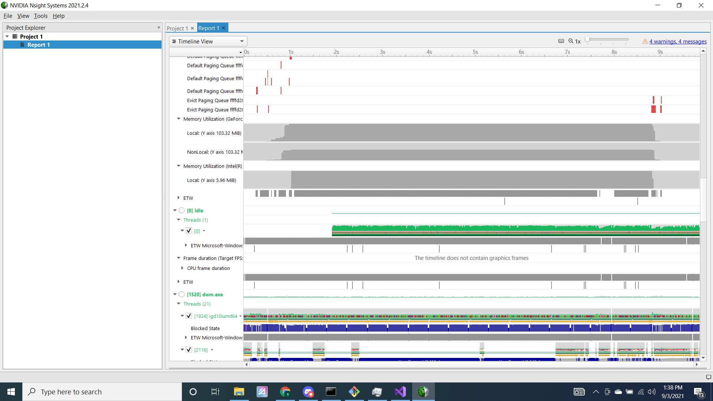
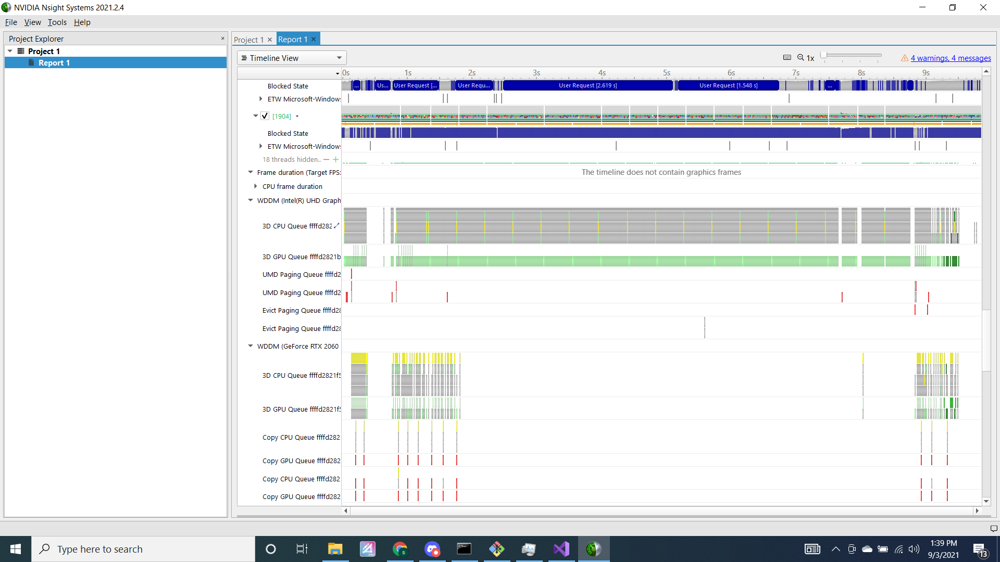
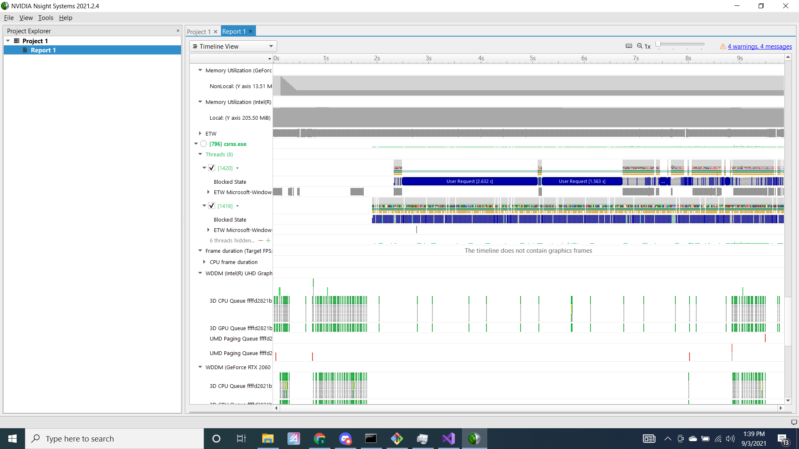
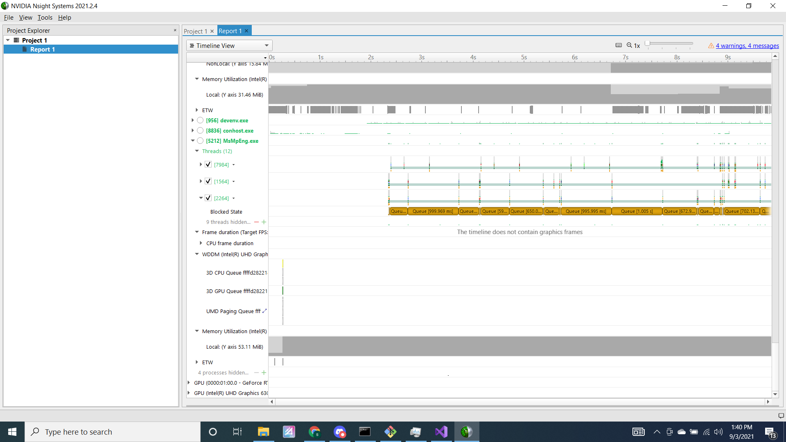

Project 0 Getting Started
====================

**University of Pennsylvania, CIS 565: GPU Programming and Architecture, Project 0**

* Stephen Lee
  * [LinkedIn](https://www.linkedin.com/in/stephen-lee-bb5a40163/)
* Tested on: Windows 10, i7-9750H @ 2.60GHz, RTX 2060 6GB (Personal computer)

Part 3.1
====================
3.1.1

3.1.2

3.1.3

3.2

3.3

