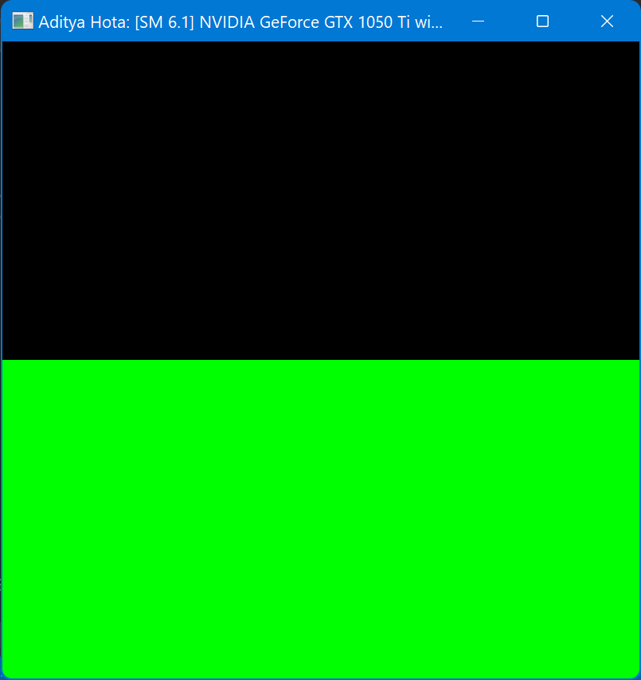
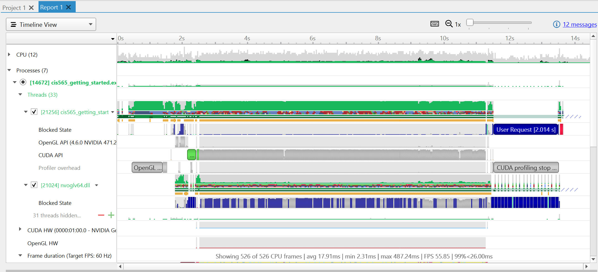
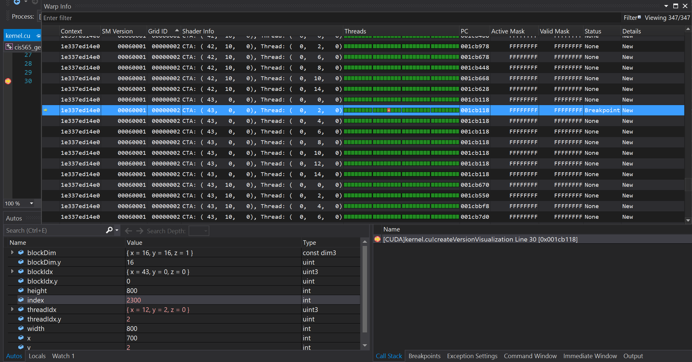
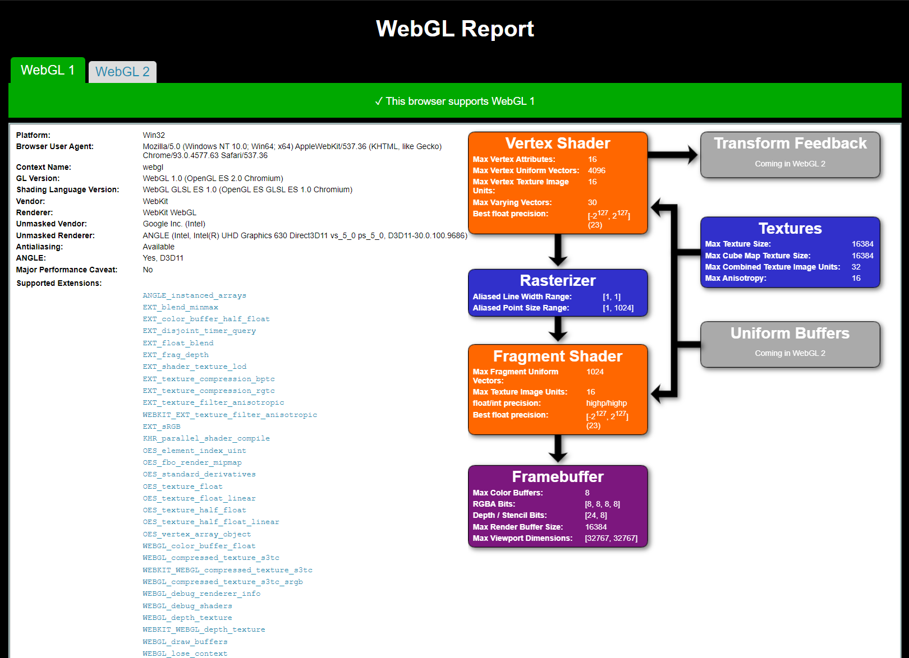
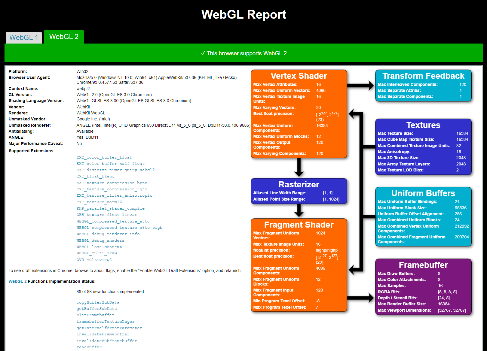
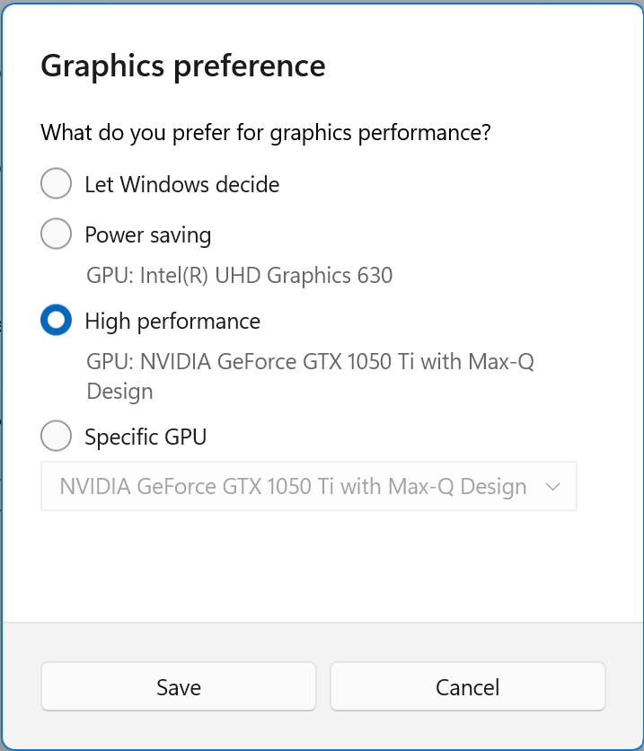
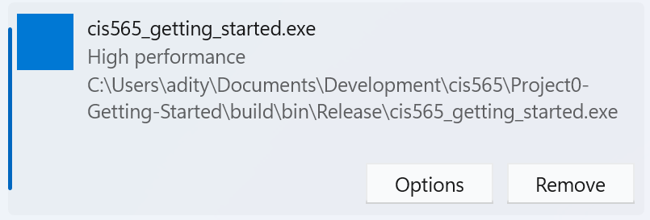

Project 0 Getting Started
====================

**University of Pennsylvania, CIS 565: GPU Programming and Architecture, Project 0**

* Aditya Hota
  * [LinkedIn](https://www.linkedin.com/in/aditya-hota)
* Tested on: Windows 11, i7-8750H @ 2.20 GHz 20 GB, GTX 1050 Ti with Max-Q Design 6 GB (personal laptop)

## Project Deliverables (Part 3)
## Part 3.1: CUDA
Compute Capability: `6.1`

### Part 3.1.1: Modify CUDA Program
Screenshot of CUDA project executable:

### Part 3.1.2: Analyze Program
Application trace timeline:

### Part 3.1.3: Nsight Debugging
The value for index 2300 is computed on thread `(12, 2, 0)` of block `(43, 0, 0)`. This is shown with the yellow arrow being on the 13th thread of the block.

## Part 3.2: WebGL
My Chrome browser supports both WebGL 1 and WebGL 2.

 

### (TODO: Your README)

Include screenshots, analysis, etc. (Remember, this is public, so don't put
anything here that you don't want to share with the world.)

## Other contributions
On Optimus machines, you may get the error `Cuda error: Kernel failed!: all CUDA-capable devices are busy or unavailable.` It looks like Windows is starting to manage automatic GPU switching rather than the NVIDIA driver, so if this issue comes up, you might be able to fix it by going to the Windows Settings app > System > Display > Graphics and manually adding the path to the compiled executable that was built in VS code. Then, you can set the GPU to NVIDIA.

 
