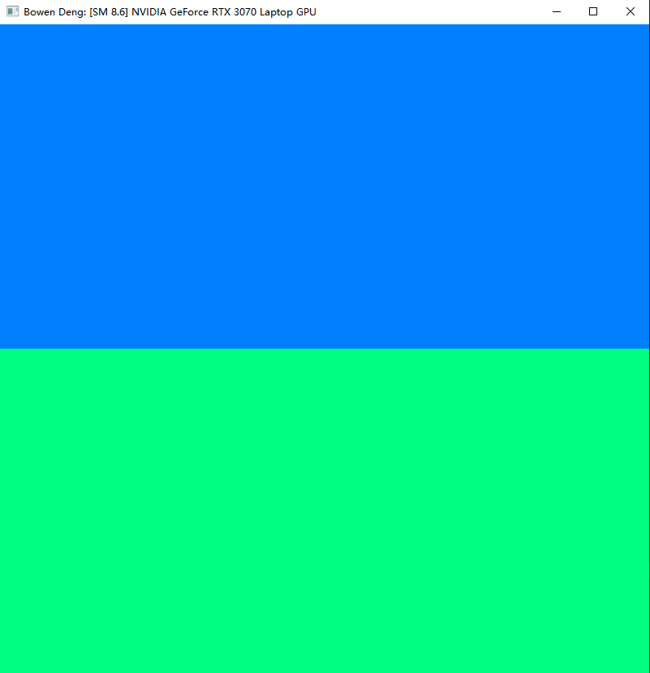
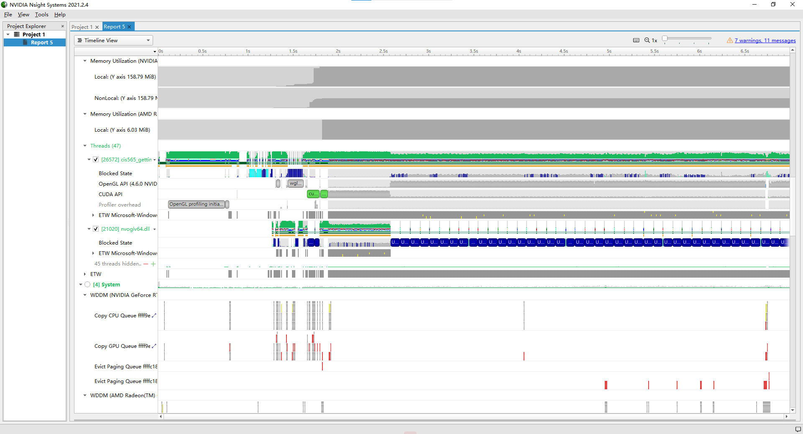
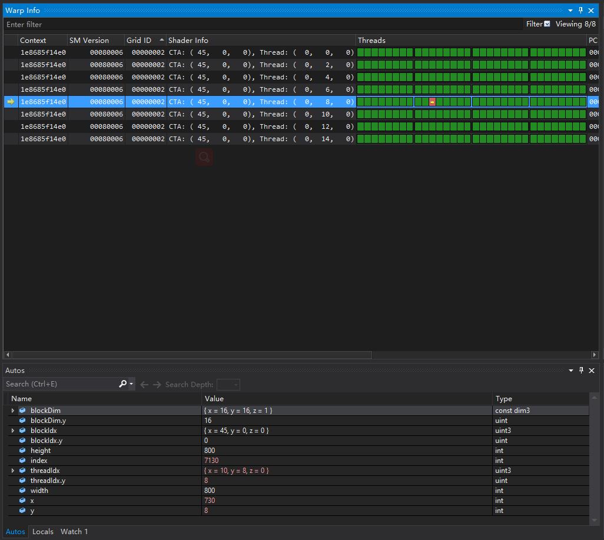
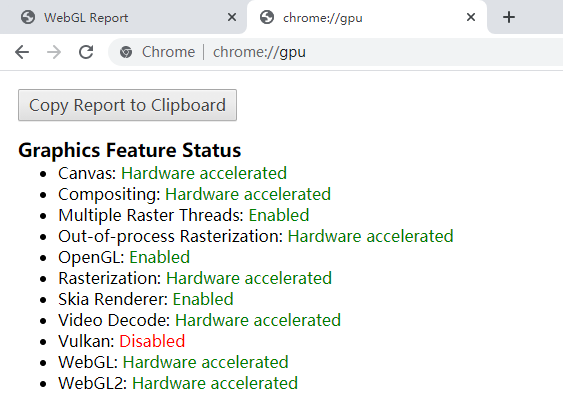
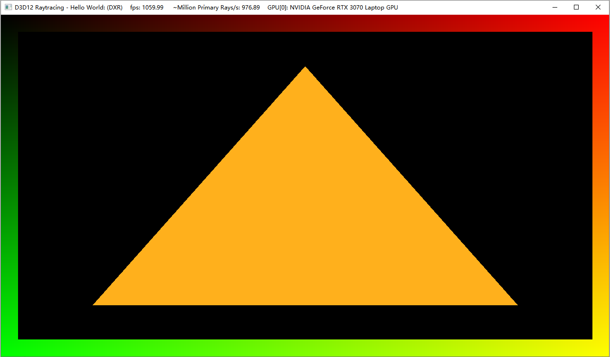

Project 0 Getting Started
====================

**University of Pennsylvania, CIS 565: GPU Programming and Architecture, Project 0**

* Bowen Deng
  * [LinkedIn](www.linkedin.com/in/bowen-deng-7dbw13), [twitter](https://twitter.com/7Dbw13)
* Tested on: Windows 10, AMD Ryzen 9 5900HX with Radeon Graphics @ 3.30GHz 16GB, GeForce RTX 3070 Laptop GPU 8GB (Personal Computer)

---

## CUDA

### CUDA Test

* Compute Capability of my GPU: 8.6

### Nsight Analysis

Tracing for CUDA and OpenGL is enabled

### Nsight Debugging

Check for `index 7130`

## WebGL

WebGL is enabled and hardware-accelerated

## DXR

* Level of DXR support: *DXR*

