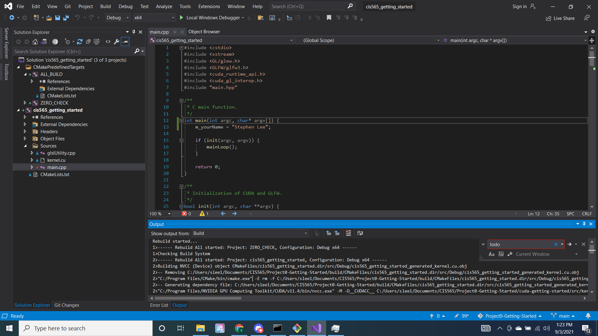
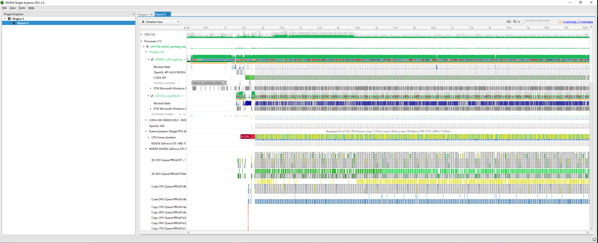
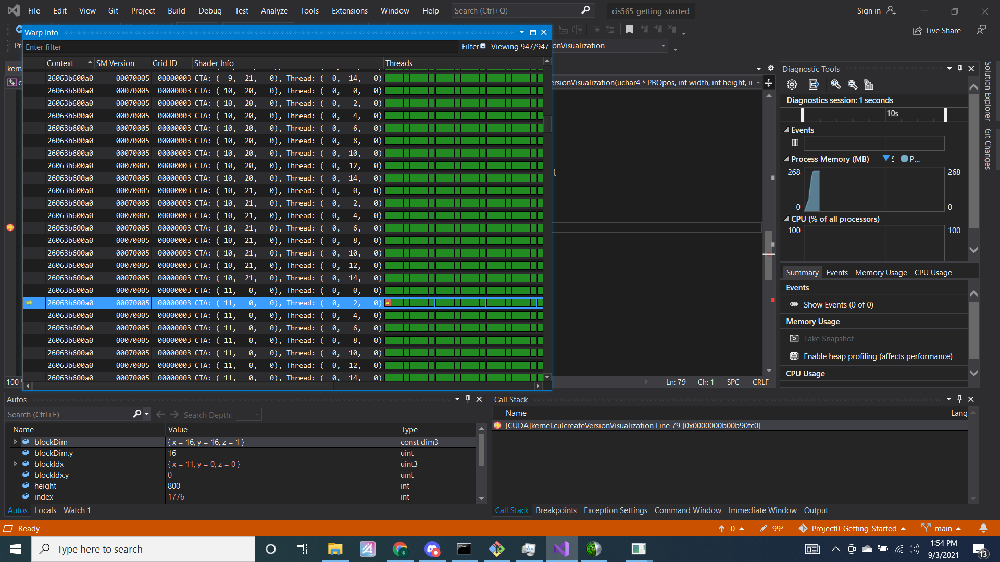
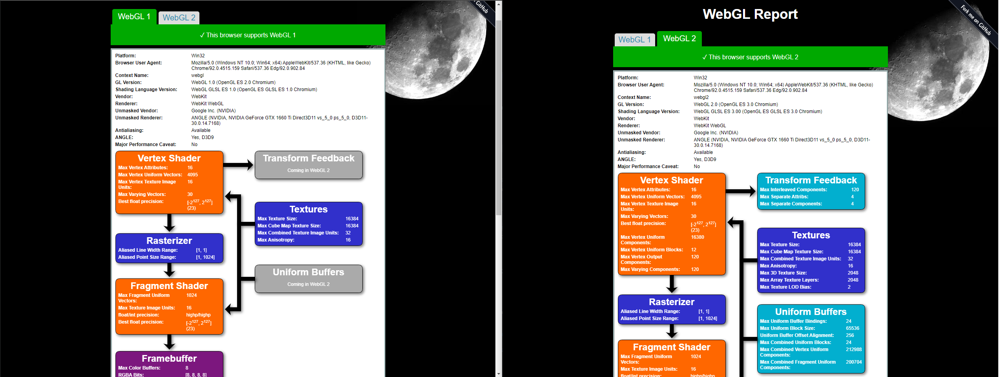
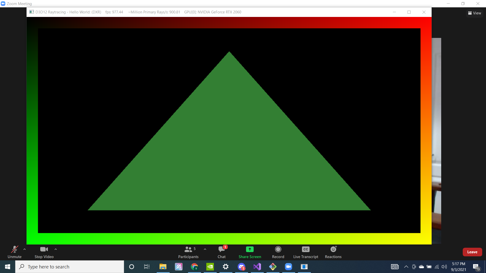

Project 0 Getting Started
====================

**University of Pennsylvania, CIS 565: GPU Programming and Architecture, Project 0**

* Shubham Sharma
  * [LinkedIn](www.linkedin.com/in/codeshubham), [personal website](https://shubhvr.com/).
* Tested on: Windows 10, i7-9750H @ 2.26GHz, 16GB, GTX 1660ti 6GB (Personal Computer.
*GPU Compute Capability: 7.5

# Project Analysis #

## Part 3.1.1: Testing CUDA

## Part 3.1.2: Analyze Performace

## Part 3.1.3: Nsight Debugging

## Part 3.2: WebGL Support

## Part 3.3: DXR Support
