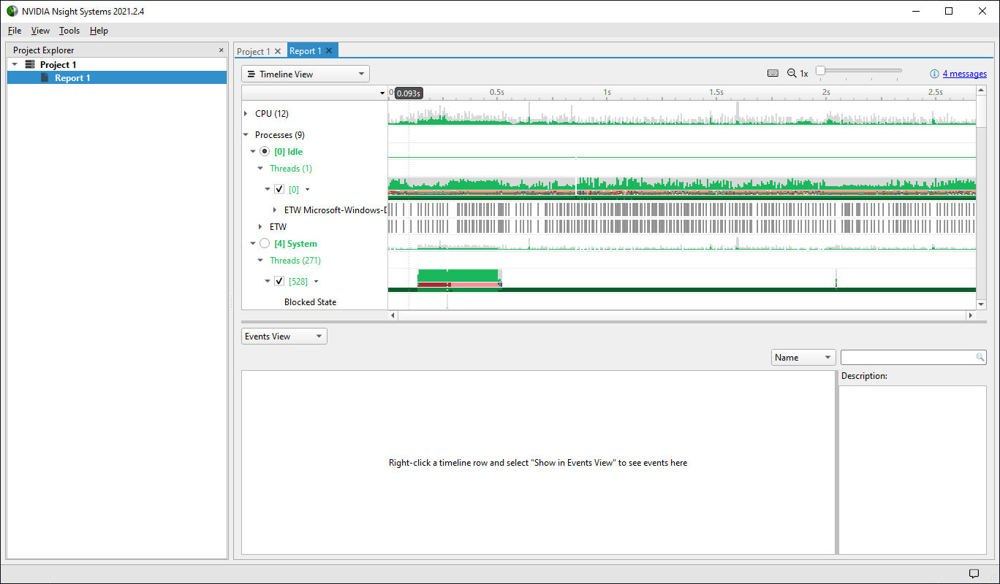
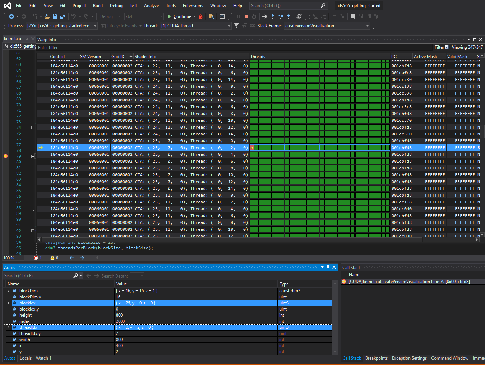
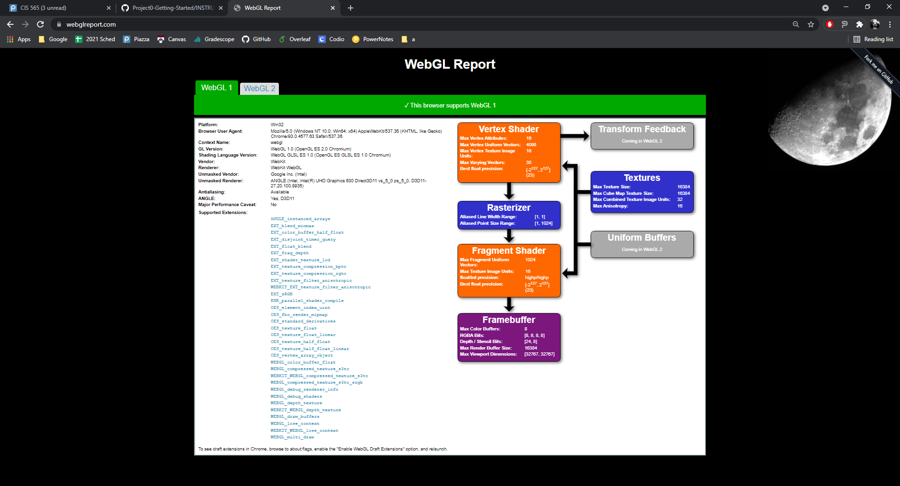
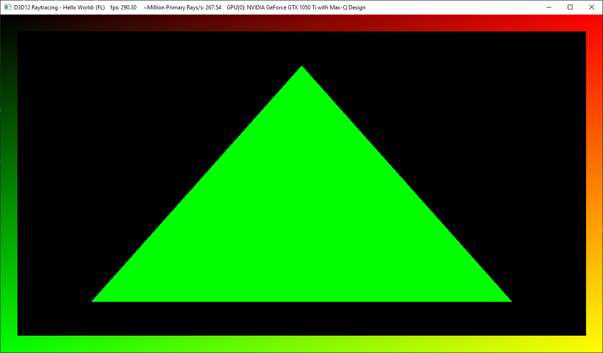

Project 0 Getting Started
====================

**University of Pennsylvania, CIS 565: GPU Programming and Architecture, Project 0**

* Raymond Yang
  * [LinkedIn](https://www.linkedin.com/in/raymond-yang-b85b19168)
* Tested on: September 1, 2021 with Windows 10

## Testing and Analysis
This section entails the results of testing config for my personal laptop (XPS 15 9570) after completing Part 1 of <a href="/INSTRUCTION.md">instructions</a>.

### Testing CUDA
My laptop successfully configured and generated a Visual Studio Solution file for building and running 'cis565_getting_started'. Prior to modification of line 13 of 'main.cpp' the output follows: 

After modification of line 13 of 'main.cpp' the output follows: 

### Analyzing CUDA
Using Nsight to analyze CUDA required additional extensions no longer native to Visual Studios. Details can be found [here](https://developer.nvidia.com/nvidia-nsight-integration-install-tips). 
In order to perform a trace, I followed 'Extensions >> Nsight >> Nsight Systems 2021.2.4 >> Trace'. The output follows: 

### Nsight Debugging
This portion of the instructions demonstrated fundamentals for using CUDA Nsight Debugging Tools. Using 'index == 2000' as the test condition, the output mapping 'blockIdx' and 'threadIdx' to 
'CTA' and 'Thread' respectively follows: 

### WebGL Verification
This portion tests whether our local computers have functionality with WebGL. The output follows: 

### DXR Verification
This portion is intended to identify the capacity of our local computers with respect to DXR. From the results, my personal laptop is exclusively capable of 'FL'. 
The results from the unmodified 'barycentric' vector value follows: 

The results from the modified 'barycentrics = float3(0, 1.0, 0)' follows: 
