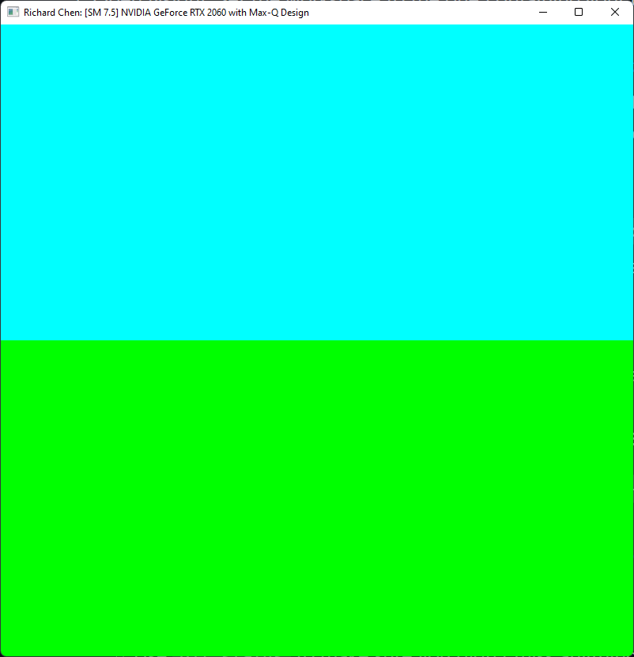
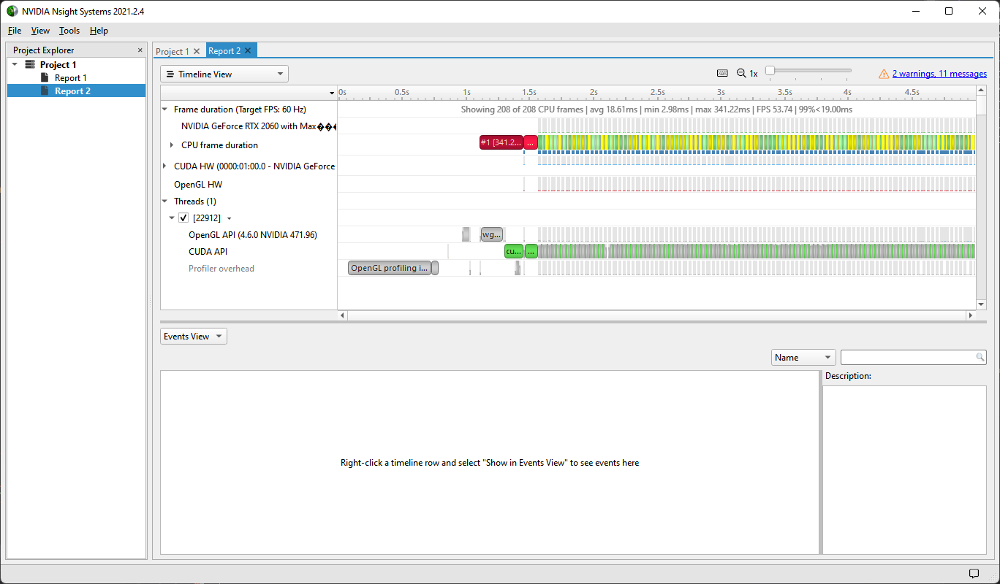
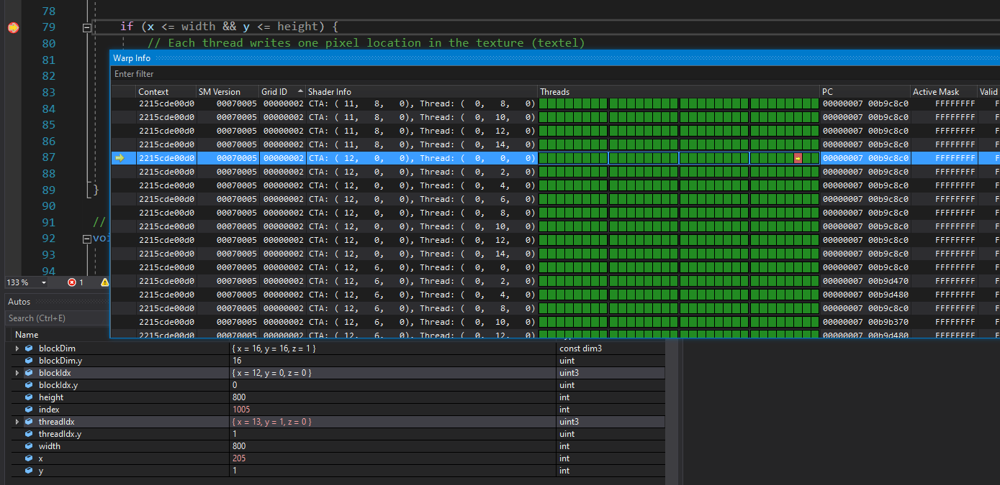
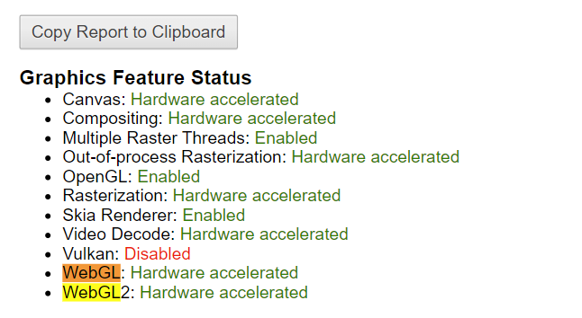
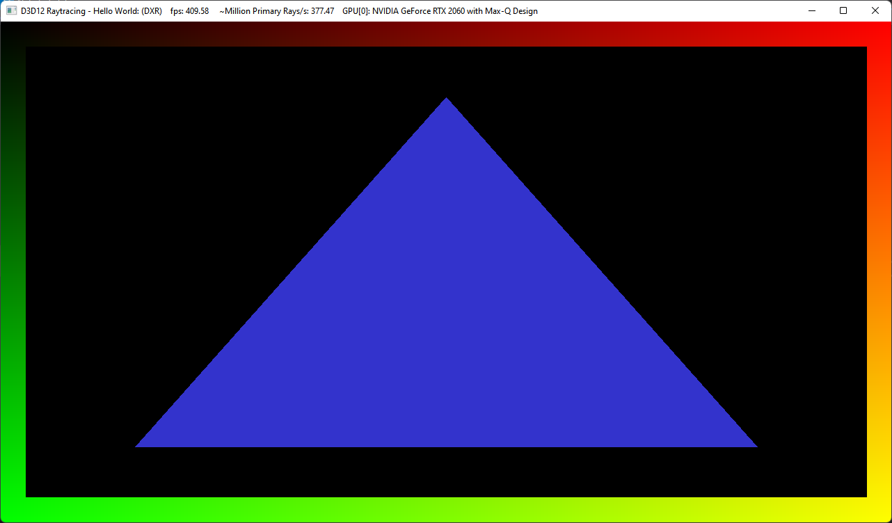

Project 0 Getting Started
====================

**University of Pennsylvania, CIS 565: GPU Programming and Architecture, Project 0**

* Richard Chen
  * [LinkedIn](https://www.linkedin.com/in/richardrlchen/)
* Tested on: Windows 11, i7-10875H @ 2.30GHz 16GB, RTX 2060 MAX-Q 6GB (Personal)

---

## Part 3

### 3.1: CUDA
Compute Capbility: 7.5

### 3.1.1: 

### 3.1.2:

### 3.1.3:

### 3.2:

### 3.3:
DXR is supported and I made my triangle blue.

