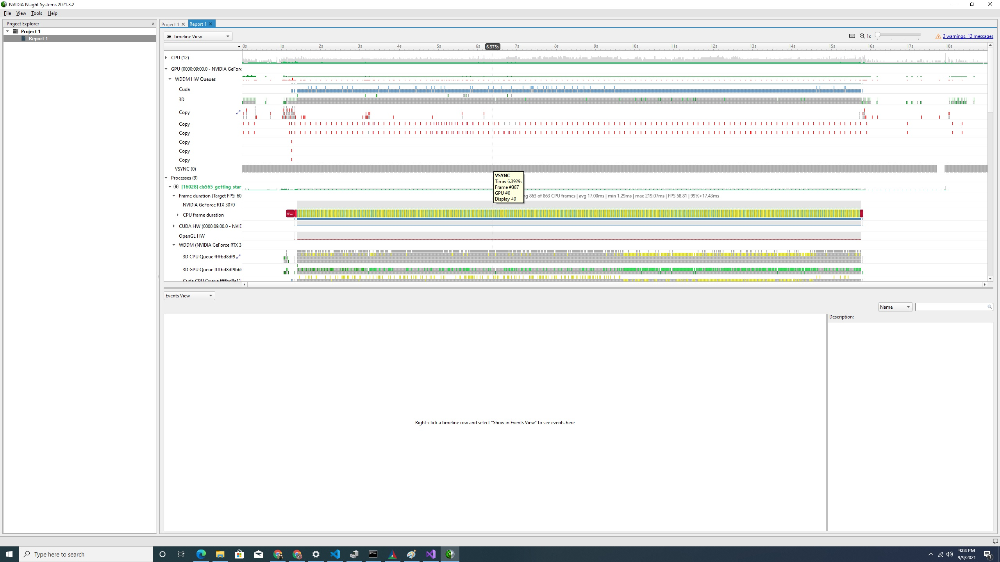
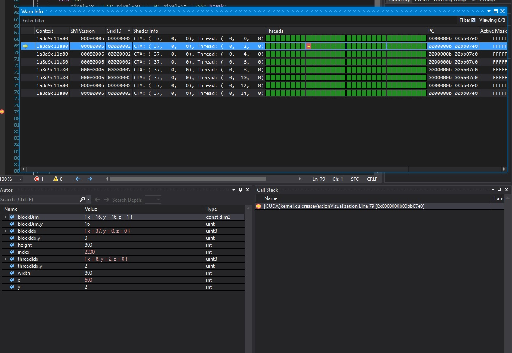
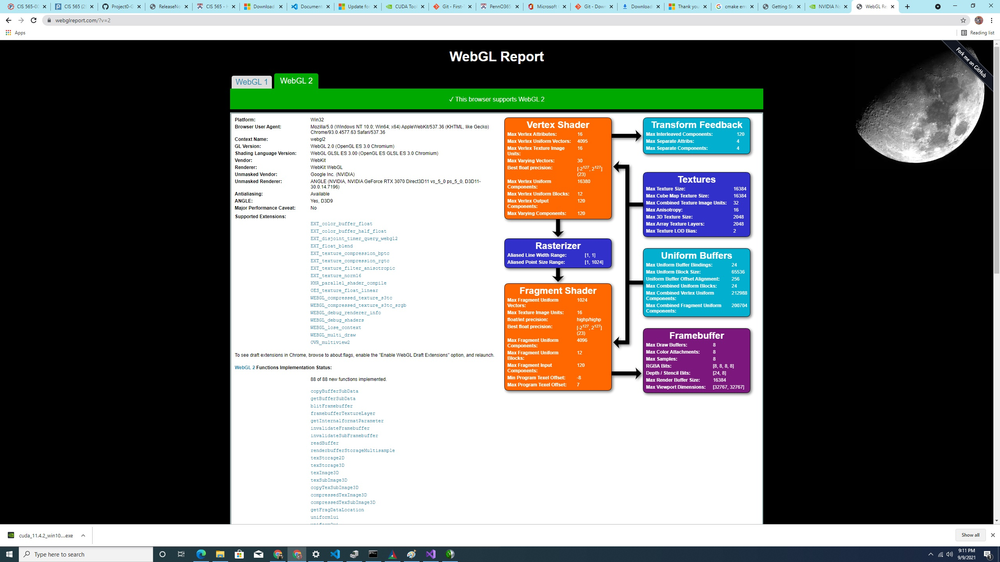
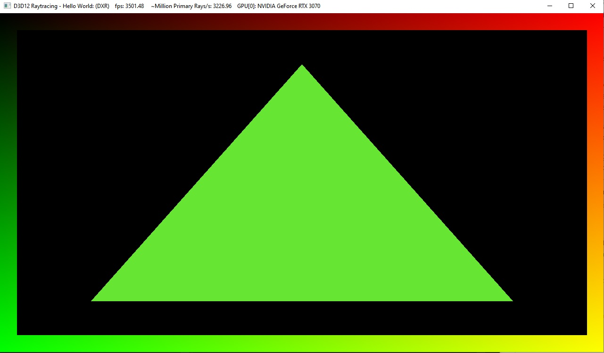

Project 0 Getting Started
====================

**University of Pennsylvania, CIS 565: GPU Programming and Architecture, Project 0**

* Wayne Wu
  * [LinkedIn](https://www.linkedin.com/in/wayne-wu/), [Personal Website](https://www.wuwayne.com/)
* Tested on: Windows 10, AMD Ryzen 5 5600X @ 3.70GHz 32GB, RTX 3070 8GB (personal)

### Write-up

