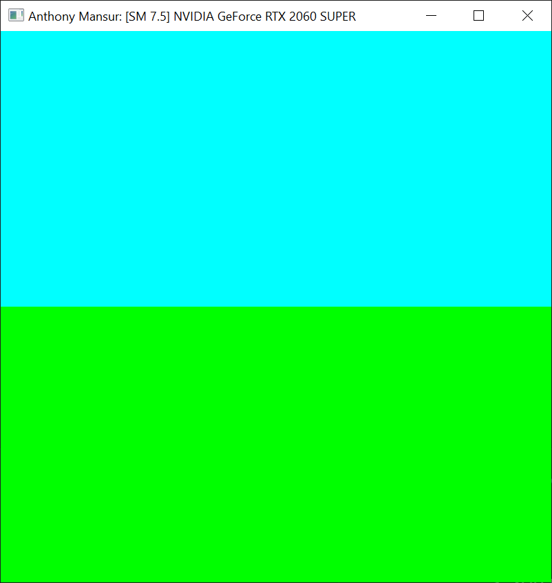
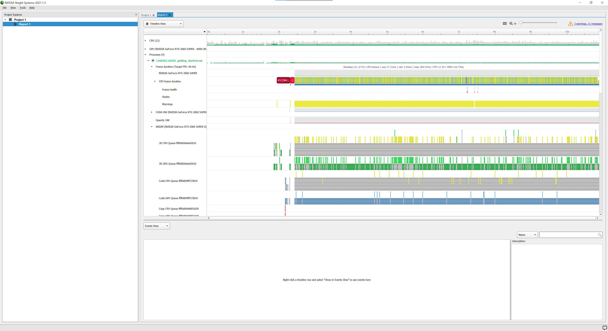
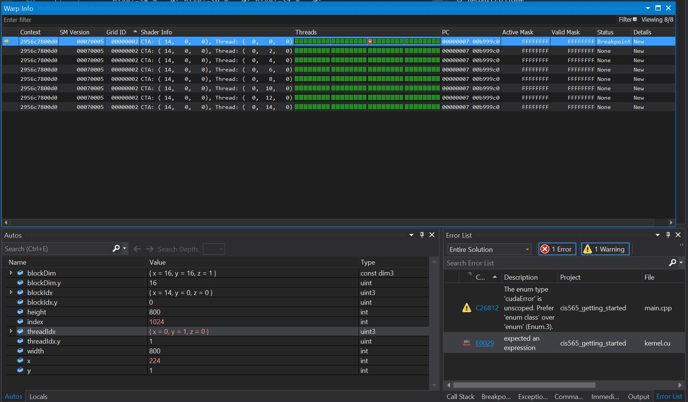
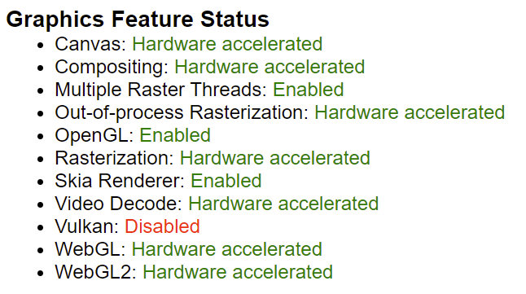
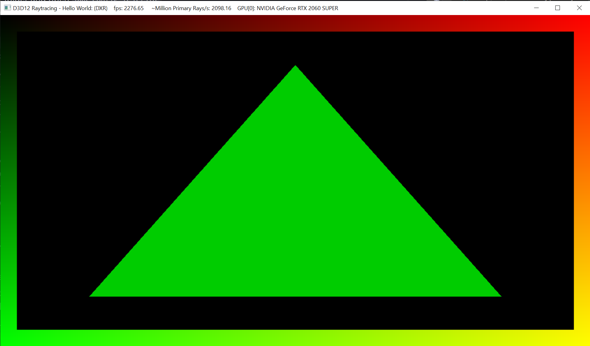

Project 0 Getting Started
====================

**University of Pennsylvania, CIS 565: GPU Programming and Architecture, Project 0**

* Anthony Mansur
  * https://www.linkedin.com/in/anthony-mansur-ab3719125/
* Tested on: Windows 10, AMD Ryzen 5 3600, Geforce RTX 2060 Super (personal)

Submission
====================

Compute Capability: 7.5

### `cuda-getting-started` window

### Nsight Performance Analysis

### Nsight Debugging

### WebGL Compatibility

### DXR Rendering

