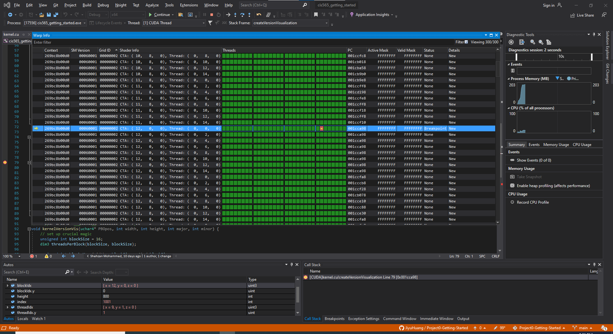
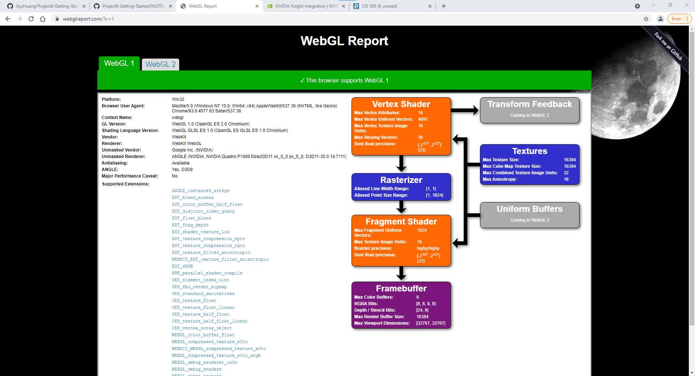
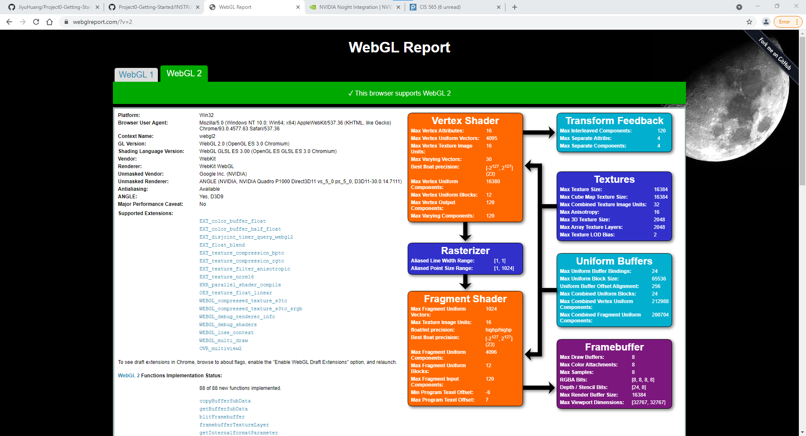

Project 0 Getting Started
====================

**University of Pennsylvania, CIS 565: GPU Programming and Architecture, Project 0**

* Jiyu Huang
  * [LinkedIn](https://www.linkedin.com/in/jiyu-huang-0123)
* Tested on: Windows 10, i7-6700 @ 3.41GHz 16GB, Quadro P1000 4096MB (Town 062 Lab)

### Write-up

I'm currently working on a lab computer. I will have a laptop available with NVIDIA GPU later on in the semester.
Using CETS lab, I'm unable to finish certain parts of the project due to not having admin permission.

#### 3.1.1 Modifying CUDA Project

#### 3.1.2 Nsight Profiling

Using CETS lab, there's no "start performance analysis" option in Nsight menu. On piazza page, it's suggested that I need to install developers tools for integration, but since I can't get admin permission I'm unable to do that.

#### 3.1.3 Nsight Debugging

#### WebGL:

#### DXR

Using CETS lab, I don't have admin permission for developer mode.