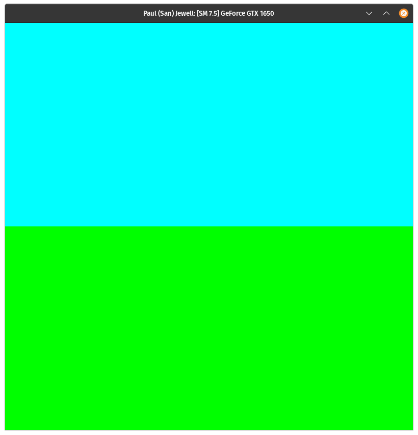
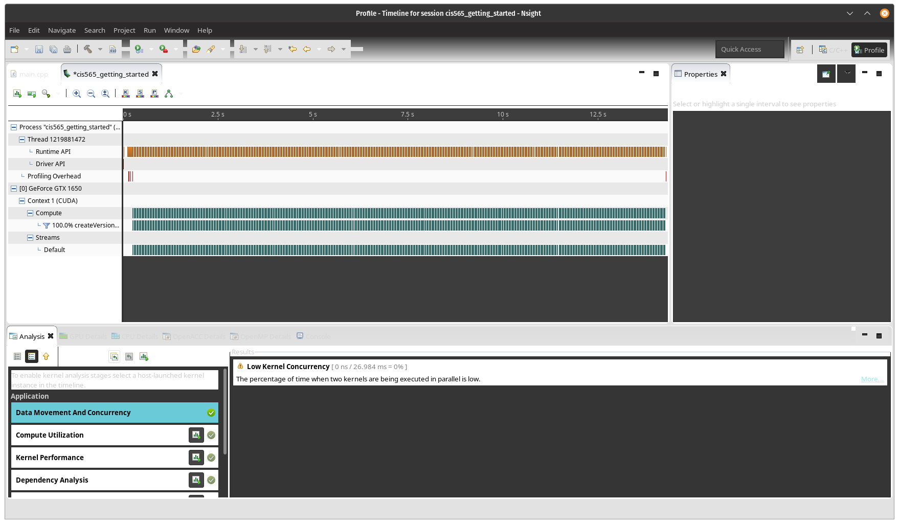
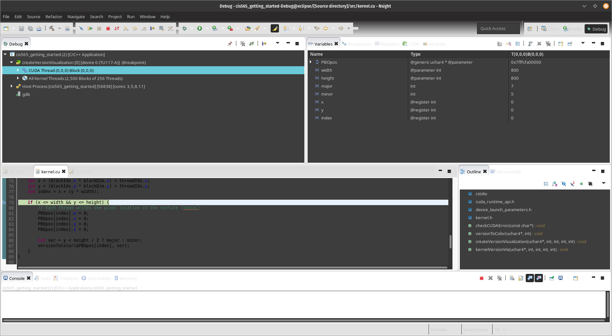
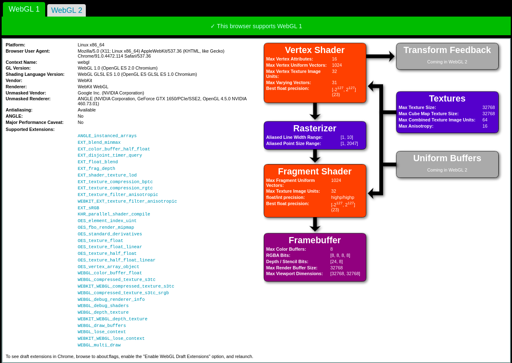
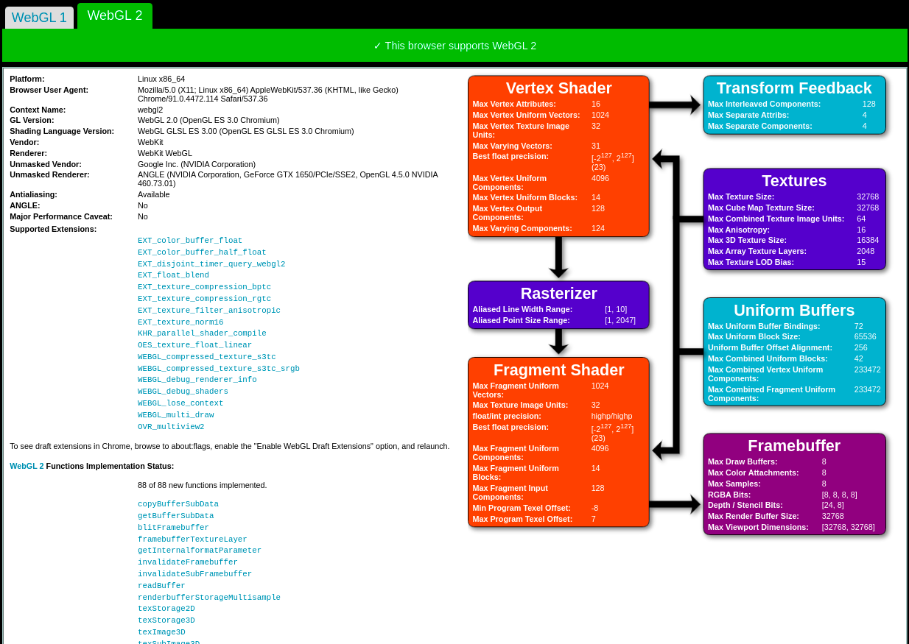

Project 0 Getting Started
====================

**University of Pennsylvania, CIS 565: GPU Programming and Architecture, Project 0**

* Paul (San) Jewell
  * [LinkedIn](https://www.linkedin.com/in/paul-jewell-2aba7379), [work website](
    https://www.biociphers.org/paul-jewell-lab-member), [personal website](https://gitlab.com/inklabapp), [twitter](https://twitter.com/inklabapp), etc.
* Tested on: (Personal machine) Linux pop-os 5.11.0-7614-generic, i7-9750H CPU @ 2.60GHz 32GB, GeForce GTX 1650 Mobile / Max-Q 4GB 

### Results

Program running

Eclipse timeline

No instructions were provided for linux debugging screenshots, so here is one of a breakpoint in use

Web GL 1

Web GL 2

yay~
