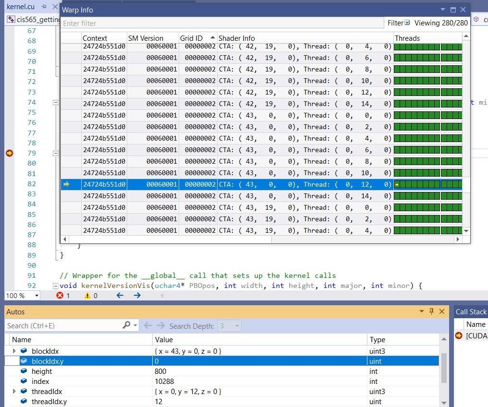
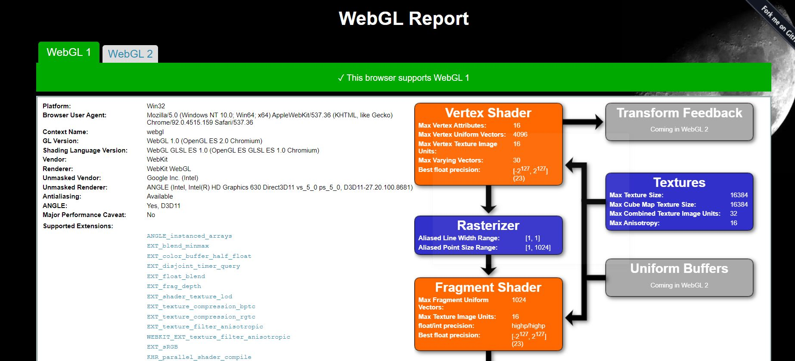
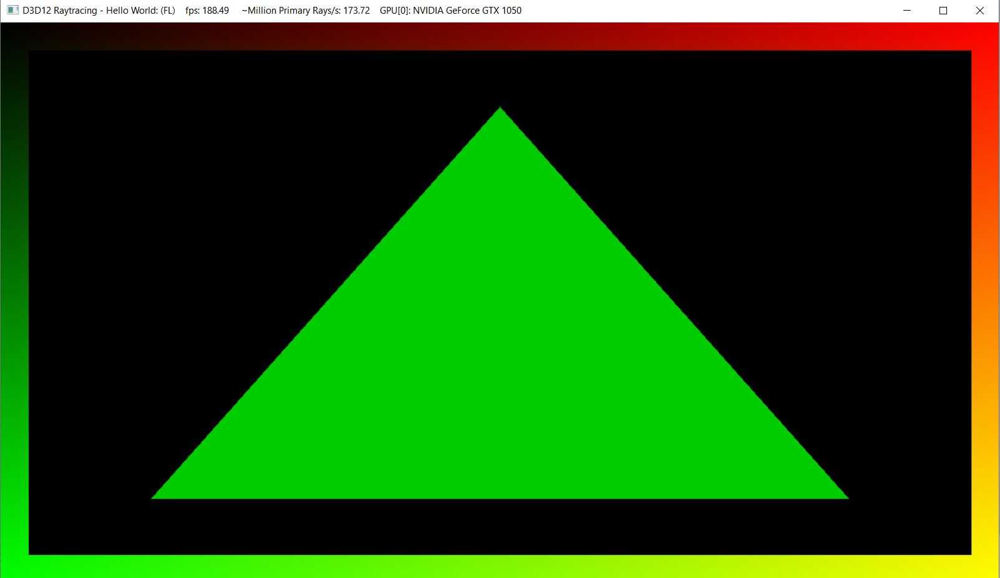

Project 0 Getting Started
====================

**University of Pennsylvania, CIS 565: GPU Programming and Architecture, Project 0**

* Yuxuan Zhu
  * [LinkedIn](https://www.linkedin.com/in/andrewyxzhu/), [personal website]()
* Tested on: Windows 10, i7-7700HQ @ 2.80GHz 16GB, GTX 1050 4096MB (Personal Laptop)

The compute capability of my GeForece GTX 1050 GPU is 6.1.

I was able to render with my GPU successfully. 

I was able to run the Nsight debugger. 

My laptop supports WebGL. 

My GPU does not have hardware support for RayTracing and is using software fallback layer. 

