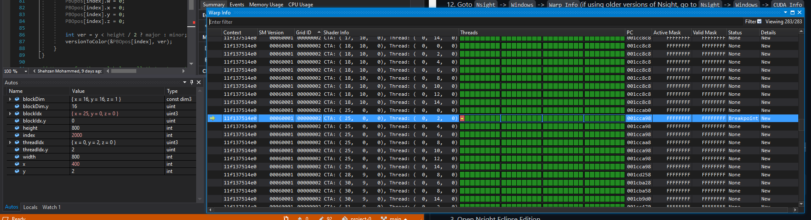
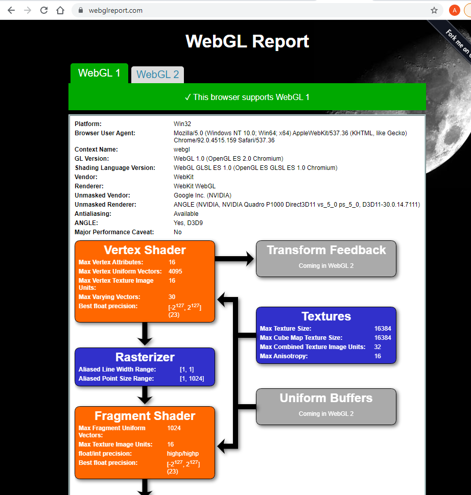
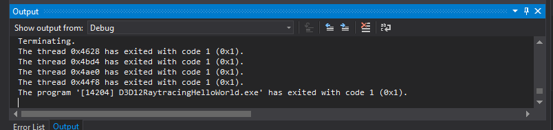

Project 0 Getting Started
====================

**University of Pennsylvania, CIS 565: GPU Programming and Architecture, Project 0**

* Ashley Alexander-Lee
  * [LinkedIn](linkedin.com/in/asalexanderlee), [Personal Website](https://asalexanderlee.myportfolio.com/)
* Tested on: Windows 10, i7-6700 @ 3.40GHz 16GB, Quadro P1000 (Towne Lab)

### GPU Compatibility 

Quadro P1000 is CUDA-compatible according to the [list of CUDA-comatible GPUS](https://developer.nvidia.com/cuda-gpus). 

### Results

#### Modified CUDA Project

#### Performance Profiling
The CETS lab computers do not have the extension installed that allows Nsight performance profiling. 

#### Nsight Debugging

#### WebGL Compatibility

#### DXR Compatibility
The CETS lab computer doesn't have a DXR compatible GPU (see the below error).

