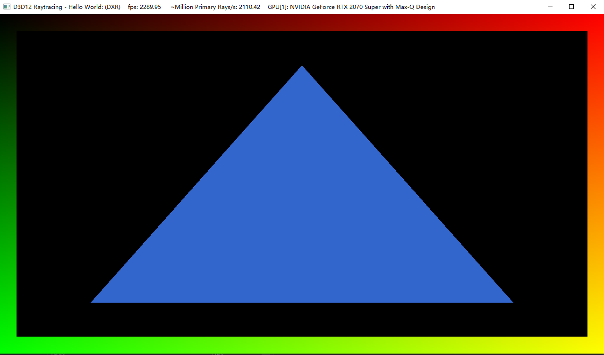

Project 0 Getting Started
====================

**University of Pennsylvania, CIS 565: GPU Programming and Architecture, Project 0**

* Xuntong Liang
  * [LinkedIn](https://www.linkedin.com/in/xuntong-liang-406429181/), [GitHub](https://github.com/PacosLelouch), [twitter](https://twitter.com/XTL90234545).
* Tested on: Windows 10, i7-10750H @ 2.60GHz 16GB, RTX 2070 Super with Max-Q 8192MB

### Part 3.1: CUDA

CUDA running result:

Analysis:

This needs us to go to `Nsight` -> `Nsight Systems 2021.2.4` -> `Trace`. 

Then in `NVIDIA Nsight Systems 2021.2.4 `, `Select target for profiling` -> `Start`. Make sure to fill in the correct `Command line with arguments` and `Working directory` in `Target application`, and check `Collect CUDA trace` and `Collect OpenGL trace`. 

Debug with Nsight:

The `blockIdx` is (12, 0, 0) and the `threadIdx` is (8, 1, 0). The thread counts from the `Shader Info` are discontinuous, and the threads between these thread indices are shown in `Threads`. We need to calculate that which is (8, 1, 0). Since the `blockDim` is (16, 16, 1), threads represented by (x, 1, 0) should be in the third or fourth group of threads. Then we can count x = 8, and find the corresponding thread, which is the first thread of the fourth group of threads.

### Part 3.2: WebGL

Check WebGL support:

### Part 3.3: DXR

DXR test, with color (0.2, 0.4, 0.8):

