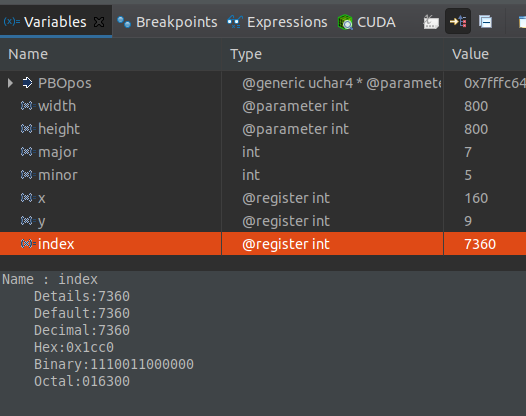

Project 0 Getting Started
====================

**University of Pennsylvania, CIS 565: GPU Programming and Architecture, Project 0**

* Matt Elser
  * [LinkedIn](https://www.linkedin.com/in/matt-elser-97b8151ba/)
* Tested on: Ubuntu 20.04, i3-10100F @ 3.6GHz 16GB, GeForce 1660 Super 6GB

## Results v2
This was previously completed on a Moore lab machine (see README in 
[v1](https://github.com/mattelser/Project0-Getting-Started/tree/e4d7c4977a13c450ca0db52ff8e1ea44a6f5f6d7)),
however it seemed prudent to re-do it with a personal machine. Other than being easier to access 
logistically, having admin privileges has enabled performance analysis. 

### ✅ run main.cpp
This output indicates the major/minor compute capability of the device, converting this data 
to colors and displaying them on the screen. Cyan indicates 7, Green indicates 4|5. The image 
is calculated using a kernel, so the display of it indicates a successful utilization of the device. 

### ✅ performance Analysis
There is a known issue on the CETS machines preventing performance analysis from running. 
The fix requires privileges beyond those provided in order to install additional developer 
tools.

### ✅ Nsight debugging
Here the debugger is halted based on a given conditional (`index` is a specified value)

### ✅ webGL verification
chrome confirms webGL is supported. 

### ❌ DirectX RayTracing
Linux lacks support for DirectX.  

