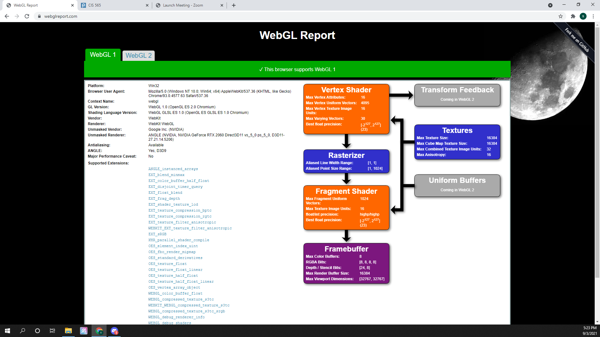

Project 0 Getting Started
====================

**University of Pennsylvania, CIS 565: GPU Programming and Architecture, Project 0**

* Shubham Sharma
  * [LinkedIn](www.linkedin.com/in/codeshubham), [personal website](https://shubhvr.com/).
* Tested on: Windows 10, i7-9750H @ 2.26GHz, 16GB, GTX 1660ti 6GB (My Laptop)
*GPU Compute Capability: 7.5

### (TODO: Your README)

Include screenshots, analysis, etc. (Remember, this is public, so don't put
anything here that you don't want to share with the world.)

