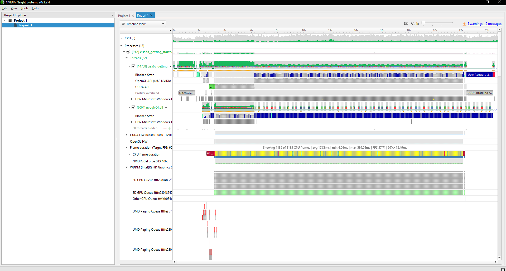
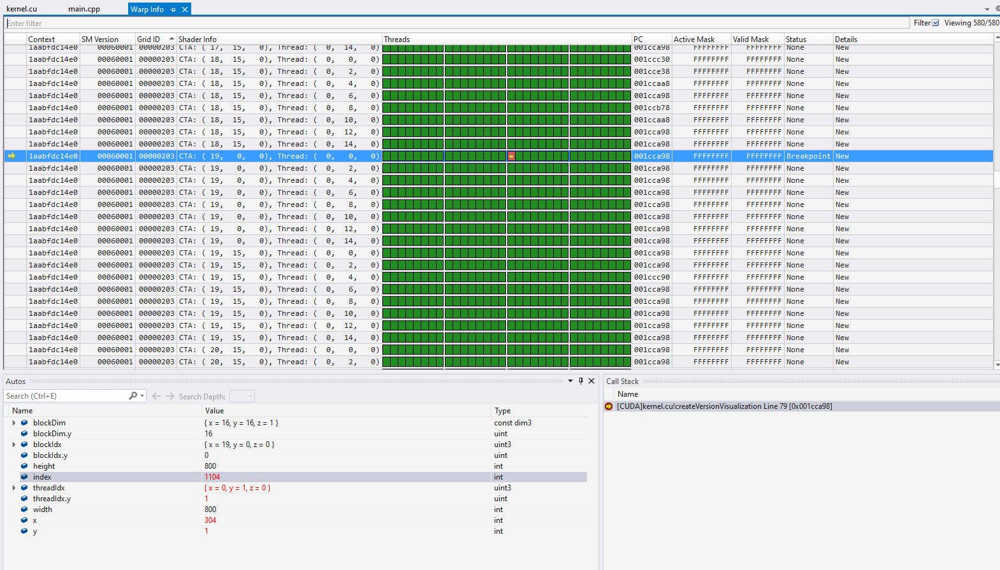
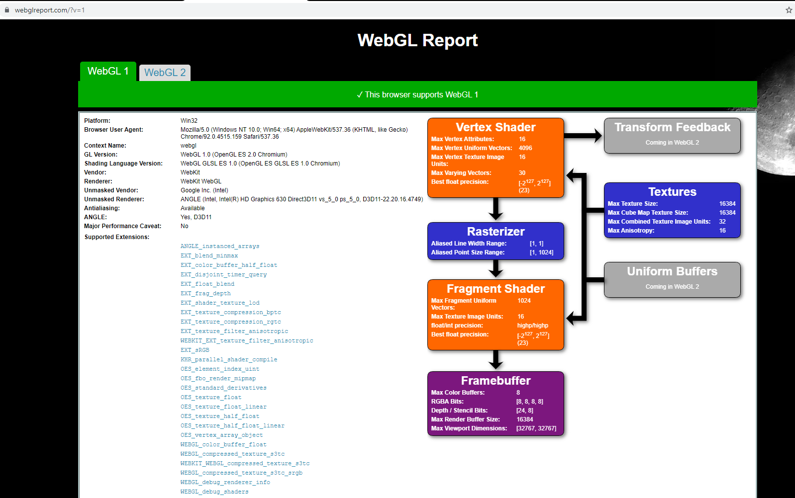
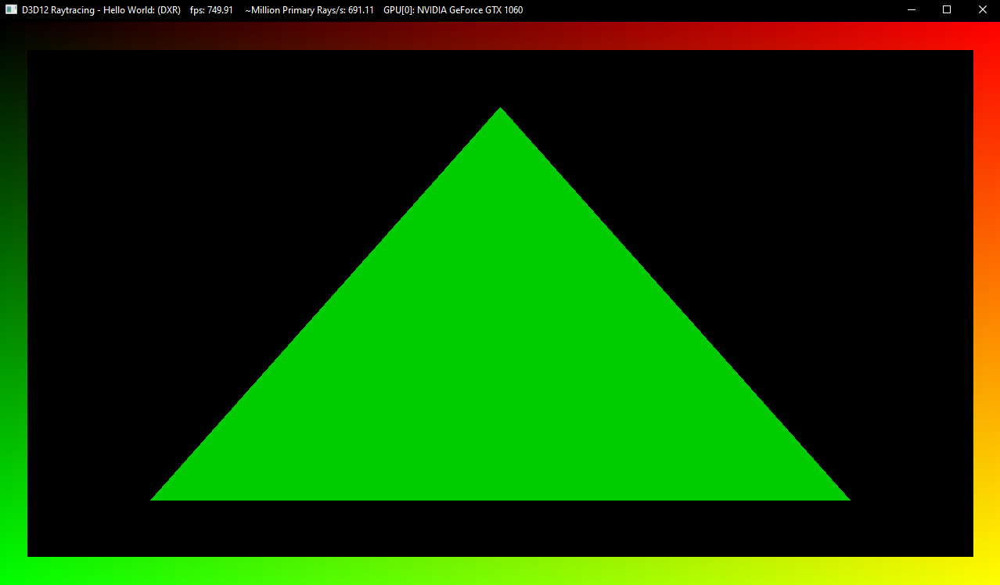

Project 0 Getting Started
====================

**University of Pennsylvania, CIS 565: GPU Programming and Architecture, Project 0**

* Yichao Wang
  * [LinkedIn](https://www.linkedin.com/in/wangyic/) etc.
* Tested on: Windows 10 Home 64-bit (10.0, Build 18363)
  * Intel(R) Core(TM) i7-7700HQ CPU @ 2.80GHz (8 CPUs)
  * GeForce GTX 1060	6.1
  * Personal computer

Include screenshots, analysis, etc. (Remember, this is public, so don't put
anything here that you don't want to share with the world.)

